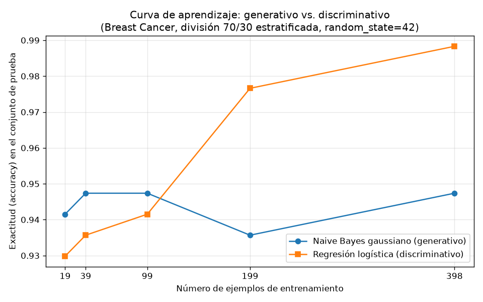

# Tarea A — Generativo contra discriminativo con pocos datos

## Introducción

Ng y Jordan (2002) mostraron que un clasificador generativo puede alcanzar su error asintótico con menos ejemplos de entrenamiento que su par discriminativo, aunque ese error asintótico sea mayor (tarea-a-generativo-discriminativo.pdf). Esta tarea comprueba esa predicción sobre datos reales comparando, sobre el conjunto Breast Cancer Wisconsin (Diagnostic), un modelo generativo —el Naive Bayes gaussiano— con un modelo discriminativo —la regresión logística—. En un modelo generativo se define primero un proceso para generar X: se muestrea la clase Y y después los atributos condicionados a ella; Naive Bayes factoriza la probabilidad conjunta con la clase como variable latente y asume independencia condicional entre atributos, su limitación principal. Un modelo discriminativo no modela la distribución de los atributos: aprende directamente la frontera de decisión (s1-transformers-y-foundation-models.md). La pregunta que guía este reporte es si, con las cifras obtenidas, se observa el cruce de curvas de aprendizaje que esa teoría predice.

## Metodología

**Datos y división única.** Se cargó el conjunto con `sklearn.datasets.load_breast_cancer` y se dividió en entrenamiento (70 %) y prueba (30 %) con `train_test_split`, estratificando por la clase y con `random_state=42`. Esta es la única división de toda la tarea: el conjunto de prueba no se usa para ajustar nada.

**Modelos.** Se entrenó un `GaussianNB` y una `LogisticRegression`. Para la regresión logística los atributos se estandarizaron con `StandardScaler` ajustado únicamente con el conjunto de entrenamiento; el mismo escalador transforma la prueba y nunca se reajusta con ella. Sobre la prueba se reportan la exactitud (accuracy) y el F1 macro de cada modelo.

**Curva de aprendizaje.** Sobre la misma división, se reentrenaron ambos modelos con submuestras estratificadas del entrenamiento correspondientes al 5 %, 10 %, 25 %, 50 % y 100 % de los ejemplos (`random_state=42`); en cada submuestra el escalador se ajustó solo con esa submuestra. Cada modelo se evaluó siempre sobre el mismo conjunto de prueba completo. La exactitud se graficó contra el número de ejemplos de entrenamiento, con una curva por modelo, y la figura se guardó como `curva_aprendizaje.png`.

## Resultados

**Parte 1 — Datos.** El conjunto tiene 569 ejemplos y 30 atributos, con 212 casos malignos (37.26 %) y 357 benignos (62.74 %). La división estratificada dejó 398 ejemplos de entrenamiento (148 malignos, 250 benignos) y 171 de prueba (64 malignos, 107 benignos).

| Conjunto | Ejemplos | Malignos | Benignos |
|---|---|---|---|
| Completo | 569 | 212 | 357 |
| Entrenamiento | 398 | 148 | 250 |
| Prueba | 171 | 64 | 107 |

**Parte 2 — Clasificadores con el entrenamiento completo.**

| Modelo | Accuracy (prueba) | F1 macro (prueba) |
|---|---|---|
| Naive Bayes gaussiano | 0.9357 | 0.9307 |
| Regresión logística | 0.9883 | 0.9875 |

**Parte 3 — Curva de aprendizaje.**

| Fracción del entrenamiento | Ejemplos de entrenamiento | Accuracy Naive Bayes | Accuracy Regresión logística |
|---|---|---|---|
| 5 % | 19 | 0.9415 | 0.9298 |
| 10 % | 39 | 0.9474 | 0.9357 |
| 25 % | 99 | 0.9474 | 0.9415 |
| 50 % | 199 | 0.9357 | 0.9766 |
| 100 % | 398 | 0.9474 | 0.9883 |

## Discusión

El cruce que predicen Ng y Jordan sí se observa con estas cifras. Con los tres tamaños pequeños de entrenamiento el Naive Bayes gaussiano supera a la regresión logística: 0.9415 contra 0.9298 con 19 ejemplos, 0.9474 contra 0.9357 con 39 y 0.9474 contra 0.9415 con 99. Con tamaños mayores la relación se invierte: con 199 ejemplos la regresión logística alcanza 0.9766 frente a 0.9357 del Naive Bayes, y con los 398 ejemplos llega a 0.9883 frente a 0.9474. El punto de cruce queda, por tanto, entre 99 y 199 ejemplos de entrenamiento.

La forma de cada curva ilustra el compromiso sesgo–varianza. El Naive Bayes converge muy temprano: con solo 19 ejemplos ya obtiene 0.9415, y en todos los tamaños sus valores permanecen entre 0.9357 y 0.9474; es decir, alcanza su régimen asintótico con muy pocos datos, pero a un nivel asintótico inferior. La regresión logística parte más baja (0.9298 con 19 ejemplos) y mejora de forma sostenida hasta 0.9883 con el entrenamiento completo, valor que coincide con la accuracy de la Parte 2; en F1 macro también domina al final, con 0.9875 contra 0.9307.

Esta diferencia se explica por el sesgo y la varianza de cada familia. El Naive Bayes gaussiano impone un sesgo fuerte: asume que los atributos son condicionalmente independientes dada la clase. Esa restricción reduce la cantidad de parámetros por estimar, de modo que la varianza del estimador es baja y el modelo se estabiliza con pocos ejemplos; el costo es que, si los atributos están correlacionados, el modelo no puede representar esas dependencias y su error asintótico es mayor. La regresión logística tiene un sesgo menor: no asume nada sobre la distribución conjunta de los atributos y ajusta directamente la frontera de decisión, lo que le permite un mejor desempeño asintótico, pero al estimar esa frontera a partir de los datos su varianza es mayor y necesita más ejemplos para aprovechar su capacidad. Con 19 ejemplos esa varianza la perjudica; con 398 la favorece.

Cabe notar que la accuracy del Naive Bayes en el punto de 398 ejemplos de la curva (0.9474) y la de la tabla de la Parte 2 (0.9357) provienen de ejecuciones separadas sobre la misma prueba; en ambos casos la regresión logística lo supera, de modo que el ordenamiento de los modelos no cambia.

## Conclusiones

Sobre Breast Cancer Wisconsin, con la división 70 %/30 % estratificada y `random_state=42`, se reproduce el patrón de Ng y Jordan (2002): el clasificador generativo (Naive Bayes gaussiano) alcanza su error asintótico con pocos ejemplos —ya con 19 obtiene 0.9415 y en ningún tamaño baja de 0.9357—, mientras que el discriminativo (regresión logística) rinde peor con pocos datos pero lo supera a partir de 199 ejemplos y termina con 0.9883 de accuracy y 0.9875 de F1 macro. En síntesis: con 99 ejemplos o menos conviene el generativo; con 199 o más, el discriminativo. El resultado se alinea con la teoría: el sesgo fuerte y la baja varianza del modelo generativo lo hacen eficiente en el régimen de pocos datos, y el sesgo menor del discriminativo le permite un error asintótico menor cuando hay datos suficientes (tarea-a-generativo-discriminativo.pdf; s1-transformers-y-foundation-models.md).