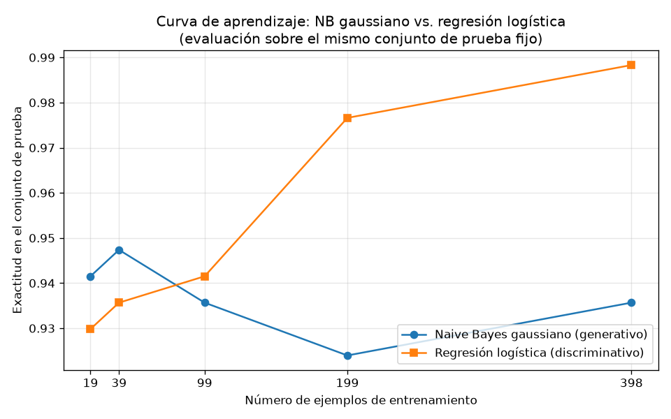

# Tarea A — Generativo contra discriminativo con pocos datos

## Introducción

Ng y Jordan (2002) predijeron que un clasificador generativo alcanza su error asintótico con menos ejemplos de entrenamiento que su par discriminativo, aunque ese error asintótico sea mayor. Esta tarea comprueba esa predicción sobre datos reales usando el conjunto Breast Cancer Wisconsin (Diagnostic) (tarea-a-generativo-discriminativo.pdf). Se comparan dos clasificadores: un Naive Bayes gaussiano (generativo, que modela P(X|Y) factorizando en atributos condicionalmente independientes dada la clase) y una regresión logística (discriminativa, que modela directamente P(Y|X)), tal como se revisaron en el curso (s1-transformers-y-foundation-models.md). Se entrenan ambos con submuestras crecientes del conjunto de entrenamiento y se evalúan siempre sobre el mismo conjunto de prueba, para trazar las curvas de aprendizaje y localizar el cruce.

## Metodología

**Datos y división.** Se cargó el conjunto con `sklearn.datasets.load_breast_cancer` y se dividió una única vez en 70 % entrenamiento y 30 % prueba con `train_test_split`, estratificando por la clase y con `random_state=42`. El conjunto de prueba no se usó para ajustar nada en toda la tarea.

**Modelos.** Se entrenó un `GaussianNB` y una `LogisticRegression` (max_iter=1000). Los atributos se estandarizaron con `StandardScaler` ajustado únicamente con el conjunto de entrenamiento (fit en train, transform en train y test).

**Curva de aprendizaje.** Sobre la misma división, se entrenaron ambos modelos con el 5 %, 10 %, 25 %, 50 % y 100 % del entrenamiento (submuestras estratificadas con `train_test_split`, `stratify=y_train`, `random_state=42`). En cada fracción el escalador se reajustó solo con esa submuestra, y la evaluación se hizo siempre sobre el mismo conjunto de prueba fijo, midiendo la exactitud.

## Resultados

**Parte 1 — Datos.** El conjunto tiene 569 ejemplos y 30 atributos, con 212 casos malignant (37.26 %) y 357 benign (62.74 %). La división estratificada produjo 398 ejemplos de entrenamiento (148 malignant, 37.19 %; 250 benign, 62.81 %) y 171 de prueba (64 malignant, 37.43 %; 107 benign, 62.57 %), lo que confirma que la estratificación se respetó en ambas particiones.

**Parte 2 — Dos clasificadores (100 % del entrenamiento, n=398).** Sobre el conjunto de prueba (171 ejemplos):

| Modelo | Accuracy (test) | F1 macro (test) |
|---|---|---|
| GaussianNB | 0.9357 | 0.9307 |
| LogisticRegression | 0.9883 | 0.9875 |

Las matrices de confusión fueron [[57, 7], [4, 103]] para GaussianNB y [[63, 1], [1, 106]] para LogisticRegression: la regresión logística comete solo 2 errores frente a 11 del Naive Bayes.

**Parte 3 — Curva de aprendizaje.** Exactitud sobre el mismo conjunto de prueba para cada tamaño de entrenamiento:

| Fracción | n_train | Accuracy NB | Accuracy LR |
|---|---|---|---|
| 0.05 | 19 | 0.9415 | 0.9298 |
| 0.10 | 39 | 0.9474 | 0.9357 |
| 0.25 | 99 | 0.9357 | 0.9415 |
| 0.50 | 199 | 0.9240 | 0.9766 |
| 1.00 | 398 | 0.9357 | 0.9883 |

## Discusión

**El cruce sí se observa.** Con los entrenamientos más pequeños, el modelo generativo gana: con 19 ejemplos, GaussianNB alcanza 0.9415 frente a 0.9298 de la regresión logística, y con 39 ejemplos, 0.9474 frente a 0.9357. El cruce ocurre entre 39 y 99 ejemplos: con 99 ejemplos la regresión logística ya supera al Naive Bayes (0.9415 frente a 0.9357). A partir de ahí la ventaja discriminativa se amplía: con 199 ejemplos, 0.9766 frente a 0.9240, y con los 398 ejemplos completos, 0.9883 frente a 0.9357. Este es exactamente el patrón de Ng y Jordan (tarea-a-generativo-discriminativo.pdf): en el régimen de pocos datos conviene el generativo, y a partir de un tamaño intermedio conviene el discriminativo.

**Convergencia temprana del generativo.** La exactitud del Naive Bayes se mueve en una banda estrecha (entre 0.9240 y 0.9474) en todos los tamaños, incluso con solo 19 ejemplos ya está cerca de su valor final con 398 (0.9415 frente a 0.9357). Es decir, el generativo alcanza esencialmente su error asintótico con muy pocos ejemplos, como predice la teoría. El costo de esa convergencia rápida es un error asintótico mayor: su techo (0.9474 con 39 ejemplos; 0.9357 con 398) queda por debajo del 0.9883 que la regresión logística alcanza con todos los datos.

**Sesgo y varianza.** La explicación es el compromiso sesgo-varianza. El Naive Bayes gaussiano impone un supuesto fuerte de independencia condicional entre los 30 atributos dada la clase (s1-transformers-y-foundation-models.md): ese supuesto fuerte implica un sesgo alto, que fija un error asintótico mayor aunque la realidad viole la independencia; a cambio, el modelo tiene pocos parámetros y baja varianza, por lo que pocas muestras bastan para estimarlo bien. La regresión logística no impone ese supuesto: tiene menor sesgo y puede llegar a un error asintótico menor (0.9883 de exactitud y 0.9875 de F1 macro con el entrenamiento completo), pero sus parámetros se estiman de forma discriminativa y requieren más datos; con 19 o 39 ejemplos su varianza la perjudica (0.9298 y 0.9357), y solo cuando el entrenamiento crece a 199 y 398 ejemplos su curva se dispara (0.9766 y 0.9883) y supera claramente al generativo. En síntesis: el generativo converge antes a un techo más bajo; el discriminativo converge más despacio a un techo más alto, y el cruce entre 39 y 99 ejemplos marca el punto donde el menor sesgo del discriminativo empieza a compensar su mayor varianza.

## Conclusiones

Sobre Breast Cancer Wisconsin, con una única división 70/30 estratificada (398 entrenamiento / 171 prueba) y evaluación fija en prueba, los resultados reproducen la predicción de Ng y Jordan: el Naive Bayes gaussiano (generativo) es superior con 19 y 39 ejemplos de entrenamiento (0.9415 y 0.9474 frente a 0.9298 y 0.9357), el cruce ocurre entre 39 y 99 ejemplos, y la regresión logística (discriminativa) domina desde 99 ejemplos hasta alcanzar 0.9883 de exactitud y 0.9875 de F1 macro con los 398 ejemplos, frente a 0.9357 y 0.9307 del Naive Bayes. El comportamiento se explica por sesgo y varianza: el supuesto de independencia del generativo le da baja varianza (convergencia rápida) pero sesgo alto (error asintótico mayor), mientras que el discriminativo, con menor sesgo y mayor varianza, necesita más datos para explotar su mejor techo. La lección práctica es que con pocos datos conviene un modelo generativo con supuestos fuertes, y con datos suficientes, uno discriminativo.