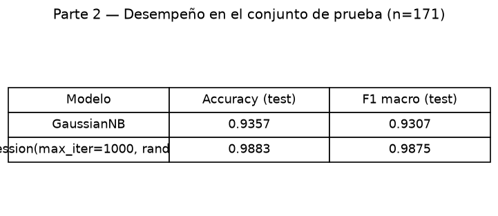
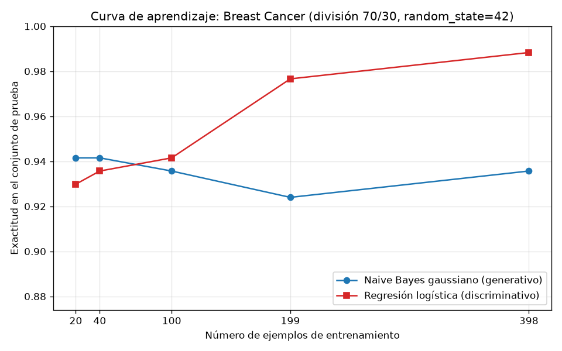

# Tarea A — Generativo contra discriminativo con pocos datos

## Introducción

Ng y Jordan (2002) mostraron que un clasificador generativo puede alcanzar su error asintótico con menos ejemplos que su par discriminativo, aunque ese error asintótico sea mayor (tarea-a-generativo-discriminativo.pdf). Esta tarea comprueba esa predicción sobre datos reales enfrentando dos paradigmas: un modelo generativo, el Naive Bayes gaussiano, que modela la distribución conjunta de atributos y etiquetas, y un modelo discriminativo, la regresión logística, que aprende directamente P(Y|X) (s1-transformers-y-foundation-models.md). Se usa el conjunto Breast Cancer Wisconsin (Diagnostic), una única división entrenamiento/prueba y curvas de aprendizaje con el 5 %, 10 %, 25 %, 50 % y 100 % del entrenamiento, evaluando siempre sobre el mismo conjunto de prueba.

## Metodología

**Datos y división única.** Los datos se cargaron con `sklearn.datasets.load_breast_cancer`: 569 ejemplos, 30 atributos, 212 casos de la clase malignant y 357 de la clase benign. La única división de la tarea se obtuvo con `train_test_split(test_size=0.3, stratify=y, random_state=42)`: 398 ejemplos de entrenamiento (148 malignant, 250 benign) y 171 de prueba (64 malignant, 107 benign). La estratificación conservó las proporciones originales: la diferencia máxima de proporciones respecto al conjunto completo fue 0.0007241833066916614 en entrenamiento y 0.001685526058849529 en prueba. El conjunto de prueba no se usó para ajustar nada en ninguna parte de la tarea.

**Modelos.** Se entrenaron `GaussianNB` y `LogisticRegression(max_iter=1000, random_state=42)`. Los atributos se estandarizaron con `StandardScaler` ajustado solo con el entrenamiento (en la Parte 3, solo con cada submuestra) y aplicado después a entrenamiento y prueba.

**Curva de aprendizaje.** Para cada fracción de {5 %, 10 %, 25 %, 50 %, 100 %} se extrajo una submuestra estratificada del entrenamiento con `random_state=42`, de tamaños 20, 40, 100, 199 y 398 ejemplos. Con cada submuestra se reajustaron el escalador y ambos modelos, y se midió la exactitud siempre sobre el mismo conjunto de prueba fijo de 171 ejemplos. Las métricas de la Parte 2 son exactitud (accuracy) y F1 macro sobre la prueba.

## Resultados

### Parte 2 — Modelos entrenados con el entrenamiento completo

| Modelo | Accuracy | F1 macro |
|---|---|---|
| GaussianNB | 0.935672514619883 | 0.9306543778801843 |
| LogisticRegression(max_iter=1000, random_state=42) | 0.9883040935672515 | 0.9875146028037383 |

Matrices de confusión en prueba (filas en el orden malignant, benign): GaussianNB [[57, 7], [4, 103]]; regresión logística [[63, 1], [1, 106]].

### Parte 3 — Curva de aprendizaje

| Fracción del entrenamiento | n entrenamiento | Exactitud GaussianNB | Exactitud regresión logística |
|---|---|---|---|
| 5 % | 20 | 0.9415204678362573 | 0.9298245614035088 |
| 10 % | 40 | 0.9415204678362573 | 0.935672514619883 |
| 25 % | 100 | 0.935672514619883 | 0.9415204678362573 |
| 50 % | 199 | 0.9239766081871345 | 0.9766081871345029 |
| 100 % | 398 | 0.935672514619883 | 0.9883040935672515 |

## Discusión

Los resultados reproducen el cruce que predicen Ng y Jordan (2002). En los entrenamientos más pequeños gana el modelo generativo: con 20 ejemplos GaussianNB alcanza 0.9415204678362573 frente a 0.9298245614035088 de la regresión logística, y con 40 ejemplos se mantiene el mismo orden (0.9415204678362573 contra 0.935672514619883). El cruce ocurre entre 40 y 100 ejemplos: con 100 la regresión logística ya supera al Naive Bayes (0.9415204678362573 contra 0.935672514619883) y la brecha se amplía con más datos, hasta 0.9883040935672515 contra 0.935672514619883 con los 398 ejemplos completos.

La forma de las curvas ilustra el papel del sesgo y la varianza. El Naive Bayes gaussiano impone un sesgo fuerte: asume que los 30 atributos son independientes dentro de cada clase y que cada uno sigue una distribución normal. Ese supuesto, aunque falso, reduce mucho los parámetros a estimar, de modo que el modelo tiene baja varianza y converge muy rápido: su exactitud casi no cambia con el tamaño de entrenamiento (0.9415204678362573 con 20 ejemplos frente a 0.935672514619883 con 398, con una pequeña fluctuación en 199). Alcanza su error asintótico con muy pocos ejemplos, pero ese error asintótico es mayor, porque el supuesto de independencia no refleja la estructura real de los datos.

La regresión logística hace supuestos más débiles sobre P(Y|X): no impone independencia condicional y estima los 30 pesos de forma conjunta. Con pocos ejemplos eso implica mayor varianza y un desempeño inicial menor (0.9298245614035088 con 20 ejemplos, el valor más bajo de toda su curva), pero un error asintótico mejor: su exactitud crece de forma monótona en esta ejecución y termina claramente por encima del generativo. Este es exactamente el patrón teórico: el generativo converge más rápido a un error asintótico mayor; el discriminativo necesita más datos, pero los aprovecha mejor (tarea-a-generativo-discriminativo.pdf).

En la práctica, con menos de unos 100 ejemplos conviene el Naive Bayes; a partir de 100 conviene la regresión logística y su ventaja crece con más datos. Conviene notar que en la zona de pocos datos las diferencias son pequeñas y que el valor más bajo observado en cualquier curva es 0.9239766081871345, de modo que ambos modelos son competitivos en este problema; aun así, el ordenamiento de las curvas y el cruce coinciden con la predicción teórica.

## Conclusiones

- El experimento confirma sobre datos reales el fenómeno de Ng y Jordan (2002): las curvas de aprendizaje se cruzan entre 40 y 100 ejemplos de entrenamiento.
- El modelo generativo (GaussianNB) converge pronto, con baja varianza gracias a su sesgo de independencia, pero se estabiliza en una exactitud menor: 0.935672514619883 con el entrenamiento completo (F1 macro 0.9306543778801843).
- El modelo discriminativo (regresión logística) parte peor con pocos datos, pero alcanza el mejor error asintótico: 0.9883040935672515 de exactitud y 0.9875146028037383 de F1 macro con 398 ejemplos.
- La disciplina metodológica (una sola división 70 %/30 %, escalador ajustado solo con datos de entrenamiento, prueba fija de 171 ejemplos) garantiza que todas las cifras del reporte provienen de la ejecución del código entregado.