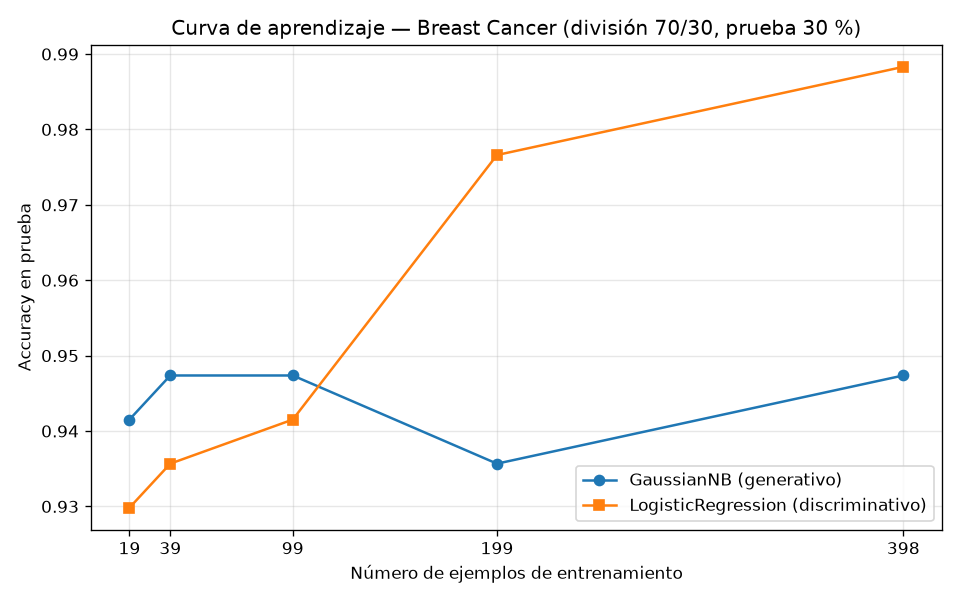

# Tarea A — Generativo contra discriminativo con pocos datos

## Introducción

Ng y Jordan (2002) mostraron que un clasificador generativo puede alcanzar su error asintótico con menos ejemplos que su par discriminativo, aunque ese error asintótico sea mayor (tarea-a-generativo-discriminativo.pdf). Esta tarea comprueba esa predicción sobre datos reales comparando dos paradigmas: un modelo generativo, el Naive Bayes gaussiano, que modela la distribución conjunta P(X,Y) factorizada mediante una variable latente de clase y cuya limitación característica es el supuesto de independencia condicional, y un modelo discriminativo, la regresión logística, que aprende directamente P(Y|X) (s1-transformers-y-foundation-models.md). Ambos se entrenan y evalúan sobre el conjunto Breast Cancer Wisconsin (Diagnostic) con una única división entrenamiento/prueba, y se contrasta su exactitud en función del tamaño de entrenamiento para localizar el cruce predicho.

## Metodología

**Datos y división.** Se cargó el conjunto Breast Cancer Wisconsin (Diagnostic) con `sklearn.datasets.load_breast_cancer`: 569 ejemplos, 30 atributos, 212 casos malignos y 357 benignos. Se dividió con `train_test_split(test_size=0.30, stratify=y, random_state=42)` en el 70 % de entrenamiento y el 30 % de prueba, lo que produce 398 ejemplos de entrenamiento (148 malignos, 250 benignos) y 171 de prueba (64 malignos, 107 benignos). La verificación de la estratificación confirmó que las proporciones de clase se conservan entre ambos conjuntos (`estratificacion_ok = true`). Esta división es la única de la tarea: el conjunto de prueba no se usó para ajustar nada.

**Modelos.** Se entrenaron un `GaussianNB` (generativo) y una `LogisticRegression` (discriminativa, `max_iter=1000`). Los atributos se estandarizaron con `StandardScaler` ajustado exclusivamente con los datos de entrenamiento (en la Parte 3, con cada submuestra), y el mismo escalador transformó la prueba.

**Curva de aprendizaje.** Sobre la misma división, se entrenaron ambos modelos con submuestras estratificadas del entrenamiento correspondientes al 5 %, 10 %, 25 %, 50 % y 100 % (`random_state=42`; por ejemplo, la de 5 % contiene 7 malignos y 12 benignos) y se evaluó la exactitud de cada uno siempre sobre el mismo conjunto de prueba completo de 171 ejemplos.

**Métricas.** Exactitud (accuracy) y F1 macro sobre el conjunto de prueba.

## Resultados

**Parte 2 — Comparación con el entrenamiento completo (398 ejemplos):**

| Modelo | Accuracy | F1 macro |
|---|---|---|
| GaussianNB (generativo) | 0.935672514619883 | 0.9306543778801843 |
| LogisticRegression (discriminativo) | 0.9883040935672515 | 0.9875146028037383 |

**Parte 3 — Curva de aprendizaje (accuracy sobre la misma prueba de 171 ejemplos):**

| Fracción del entrenamiento | n ejemplos | Accuracy GaussianNB | Accuracy LogisticRegression |
|---|---|---|---|
| 5 % | 19 | 0.9415204678362573 | 0.9298245614035088 |
| 10 % | 39 | 0.9473684210526315 | 0.935672514619883 |
| 25 % | 99 | 0.9473684210526315 | 0.9415204678362573 |
| 50 % | 199 | 0.935672514619883 | 0.9766081871345029 |
| 100 % | 398 | 0.9473684210526315 | 0.9883040935672515 |

## Discusión

Los resultados muestran el cruce que predicen Ng y Jordan (2002). Con los entrenamientos más pequeños gana el generativo: con 19 ejemplos, GaussianNB alcanza 0.9415204678362573 frente a 0.9298245614035088 de la regresión logística; con 39 ejemplos la relación es 0.9473684210526315 contra 0.935672514619883, y con 99 ejemplos 0.9473684210526315 contra 0.9415204678362573. El cruce ocurre entre 99 y 199 ejemplos: con 199, la regresión logística ya supera con claridad al Naive Bayes (0.9766081871345029 contra 0.935672514619883) y con los 398 ejemplos completos mantiene la ventaja (0.9883040935672515 contra 0.9473684210526315). Es decir, con hasta 99 ejemplos de entrenamiento conviene el modelo generativo y a partir de 199 conviene el discriminativo.

La forma de las curvas explica este comportamiento. La curva de GaussianNB es casi plana: entre 19 y 398 ejemplos su exactitud se mueve en una banda estrecha (0.9415204678362573, 0.9473684210526315, 0.9473684210526315, 0.935672514619883, 0.9473684210526315), de modo que alcanza su régimen asintótico con muy pocos ejemplos, pero ese régimen es peor: con todo el entrenamiento llega a 0.9473684210526315, por debajo del 0.9883040935672515 de la regresión logística. La curva del discriminativo, en cambio, crece de forma sostenida (0.9298245614035088, 0.935672514619883, 0.9415204678362573, 0.9766081871345029, 0.9883040935672515): converge más lentamente, pero hacia un error asintótico mejor. Este patrón coincide con la predicción teórica que la tarea pide contrastar (tarea-a-generativo-discriminativo.pdf).

En términos de sesgo y varianza: el Naive Bayes gaussiano tiene un sesgo fuerte, porque asume independencia condicional entre los 30 atributos dada la clase, la limitación propia del método (s1-transformers-y-foundation-models.md), pero una varianza baja, pues estima los parámetros de cada atributo de forma separada para cada clase, sin ajuste conjunto; por eso su desempeño se estabiliza ya con 19–39 ejemplos. La regresión logística tiene menor sesgo, porque no impone la independencia y ajusta P(Y|X) de forma conjunta sobre los 30 atributos, pero mayor varianza: con solo 19 ejemplos su estimación es inestable y rinde peor que el generativo. Al aumentar el tamaño de entrenamiento, la varianza del discriminativo disminuye y su menor sesgo domina, lo que produce el cruce a su favor. El F1 macro de la Parte 2 confirma la misma lectura con el entrenamiento completo: 0.9306543778801843 para GaussianNB frente a 0.9875146028037383 para la regresión logística.

## Conclusiones

- Sobre Breast Cancer Wisconsin (569 ejemplos, 30 atributos), con la división 70 %/30 % estratificada (398 de entrenamiento y 171 de prueba), la regresión logística discriminativa supera al Naive Bayes gaussiano con el entrenamiento completo: accuracy de 0.9883040935672515 contra 0.935672514619883 y F1 macro de 0.9875146028037383 contra 0.9306543778801843.
- Se observa el cruce predicho por Ng y Jordan (2002): el generativo es superior con 19, 39 y 99 ejemplos de entrenamiento; el discriminativo lo supera entre 99 y 199 ejemplos y se mantiene arriba con 398.
- El generativo alcanza su meseta con muy pocos ejemplos (varianza baja, sesgo alto por el supuesto de independencia condicional), mientras que el discriminativo converge más despacio hacia un mejor error asintótico (menor sesgo, mayor varianza), exactamente el compromiso teórico planteado en tarea-a-generativo-discriminativo.pdf.