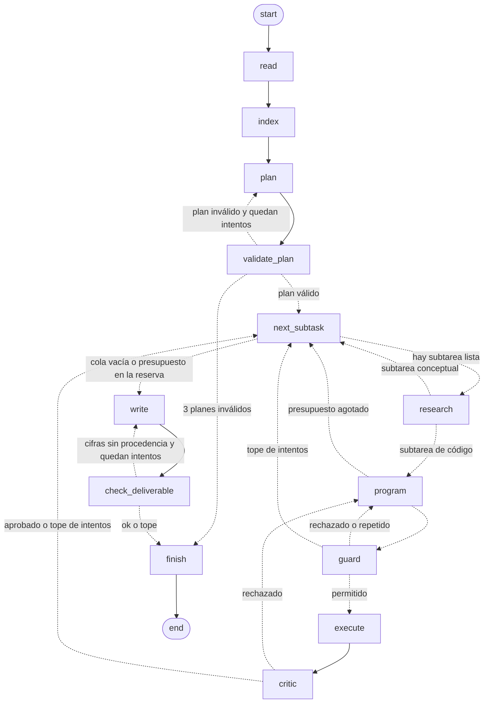
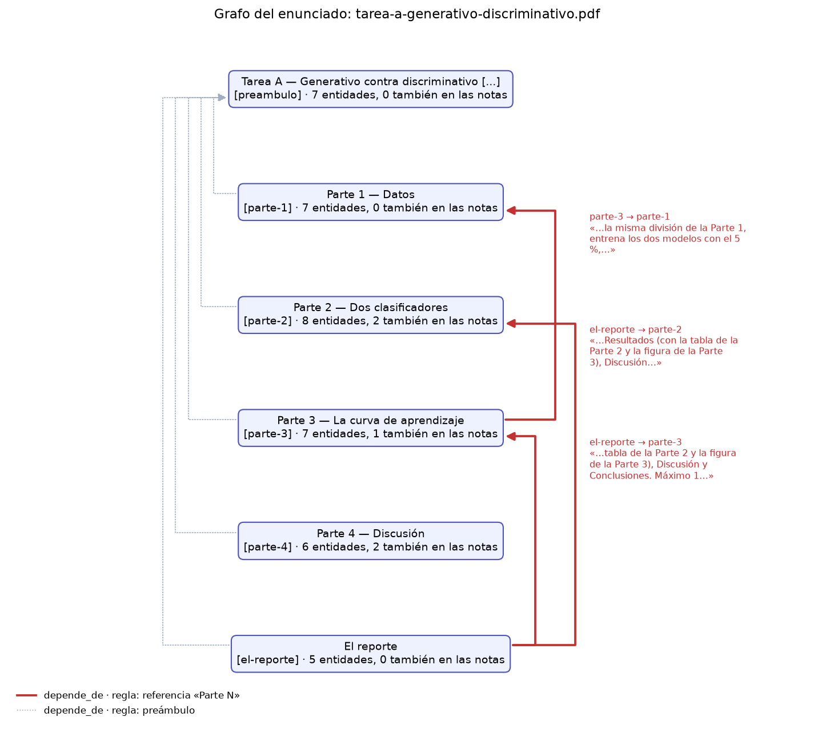

# Taller 03 v2 — Un solver multiagente con GraphRAG: del enunciado en PDF al reporte medido

**Materia:** MMIA 6013 IA Generativa y Agentes · Universidad San Francisco de Quito
**Integrantes:** Roberth Chachalo
**Fecha:** 05/10/2026

**Entorno:** Python 3.13.14 · dependencias fijadas en `uv.lock` · kit `solver-v2` del Lab-03 (2026-10-02)

---

## Parte 0 — Tres fallas que no fallan (10 %)

Las salidas crudas están en [`informe/parte0/`](parte0/). Los scripts son los del kit, sin modificar
(`solver-v2/parte0/`).

### 0.a — El solver que no ejecuta (4 %)

```bash
python parte0/a_llm_sin_ejecutar.py
```

**Ruta y modelo:** H200 de la USFQ (VPN) · vLLM `172.28.230.10:12555` · `zai-org/GLM-5.3-Flash`
(leído de `/v1/models`) · 2026-10-04

**Salida** ([`0a_salida.txt`](parte0/0a_salida.txt)):

```
Medido ejecutando el código (sklearn, semilla 42):
   NB accuracy    0.9474
   NB F1 macro    0.9429
   LR accuracy    0.9883
   LR F1 macro    0.9875

LLM sin herramientas: zai-org/GLM-5.3-Flash, 2026-10-04, 11260 tokens de salida, 68.73 s, fin=stop
   reporte en parte0/reporte_sin_ejecutar.md; 22 cifras con decimales:
   0.9415, 0.9372, 0.9766, 0.9750, 0.9240, 0.8889, 0.9298, 0.9240, 0.9357, 0.9532, 0.9415, 0.9649, 0.9415, 0.9766, 0.9240, 0.8889, 0.9766, 0.9415, 0.9415, 0.8889 …

   Procedencia: 0 de 22 cifras salen de una ejecución (no hubo ninguna). Compáralas con las medidas arriba.
   ¿Dice el reporte que las cifras son estimadas? no
```

El reporte completo del LLM está en [`0a_reporte_llm.md`](parte0/0a_reporte_llm.md). Trae en su anexo el
código que supuestamente produjo las cifras. Lo ejecutamos tal cual
([`0a_anexo_llm.py`](parte0/0a_anexo_llm.py)): **se cae** al 100 % del entrenamiento
(`ValueError: train_size=398 should be ... smaller than the number of samples 398`). Con la corrección
mínima de usar el entrenamiento completo en ese punto
([`0a_anexo_llm_corregido.py`](parte0/0a_anexo_llm_corregido.py),
[salida](parte0/0a_anexo_llm_corregido_salida.txt)), el propio código del LLM da otras cifras:

**Parte 2 — entrenamiento completo (n = 398):**

| Cifra | Reporte del LLM | Medida (script del kit) | Código del propio LLM, ejecutado |
|---|---|---|---|
| Exactitud NB | 0,9415 | 0,9474 | 0,9357 ¹ |
| F1 macro NB | 0,9372 | 0,9429 | 0,9307 ¹ |
| Exactitud LR | 0,9766 | 0,9883 | 0,9883 |
| F1 macro LR | 0,9750 | 0,9875 | 0,9875 |

¹ El anexo del LLM entrena NB sobre atributos estandarizados; el kit, sobre los atributos crudos.

**Parte 3 — curva de aprendizaje (exactitud en prueba):**

| n entrenamiento | NB (LLM) | NB (ejecutado) | LR (LLM) | LR (ejecutado) |
|---|---|---|---|---|
| 20 (5 %) | 0,9240 | 0,9415 | 0,8889 | 0,9298 |
| 40 (10 %) | 0,9298 | 0,9415 | 0,9240 | 0,9357 |
| 100 (25 %) | 0,9357 | 0,9357 | 0,9532 | 0,9415 |
| 199 (50 %) | 0,9415 | 0,9240 | 0,9649 | 0,9766 |
| 398 (100 %) | 0,9415 | 0,9357 | 0,9766 | 0,9883 |

Lo que el reporte afirma y la ejecución desmiente:

- **El tamaño de la ventaja con pocos datos:** el reporte dice que NB gana «por 3,5 puntos» con n = 20
  (0,9240 contra 0,8889). Ejecutado, la ventaja es de 1,2 puntos (0,9415 contra 0,9298).
- **La meseta de NB:** el reporte dice que NB «queda clavado en 0,9415 desde n = 199» por su error
  asintótico. Ejecutado, NB no es monótono: baja a 0,9240 en n = 199.
- **El entregable:** el reporte enlaza `curva_aprendizaje.png`, una figura que nunca existió, y un
  código que no termina.

**1. ¿Por qué que las cifras estén cerca no las hace aceptables?**

Porque el modelo no las midió: las produce a partir de los patrones de los datos con que fue
entrenado, y ninguna sale de una ejecución. Aunque coincidieran exactamente con las reales, no serían
confiables, porque sin la ejecución no hay forma de saber cuáles están cerca y cuáles no: la cercanía
solo se ve cuando ya se tiene la medida.

**2. ¿Qué cifra del reporte habría cambiado una conclusión?**

La exactitud de la regresión logística con n = 20 (5 % del entrenamiento): el reporte dice 0,8889 y,
ejecutado, da 0,9298. Esa cifra inventada infla la ventaja de Naive Bayes con pocos datos (3,5 puntos en
lugar de 1,2) y sostiene la «conclusión práctica» del reporte —con ≤ 40 ejemplos conviene NB— con mucha
más fuerza de la que los datos permiten.

**3. ¿Qué tendría que comprobar un verificador para detectarlo sin conocer las respuestas correctas?**

De dónde salió cada cifra: que cada número del reporte aparezca en algo que escribió una ejecución
(un `resultados.json`, un CSV, un log, la salida de una celda). El verificador no necesita saber el
valor correcto, solo su procedencia; en esta corrida, 0 de 22 cifras la tienen.

### 0.b — El RAG plano que pierde la referencia (3 %)

```bash
python parte0/b_rag_plano.py
```

**Salida** (2026-10-04, sin red):

```
Pregunta del programador: «¿Con qué datos y con qué partición se calcula la curva de aprendizaje?»

1) RAG plano: los 2 fragmentos más similares (TF-IDF, coseno)
   Parte 4      sim=0.293
   Parte 3      sim=0.243
   El contexto cubre: ✗ conjunto de datos  ✗ proporción de prueba  ✗ prueba intocable

2) Los mismos 2 fragmentos, más un salto por las aristas depende_de del grafo
   Parte 4 —depende_de→ (ninguna)
   Parte 3 —depende_de→ Parte 1
   El contexto cubre: ✓ conjunto de datos  ✓ proporción de prueba  ✓ prueba intocable

Las aristas que el regex encontró en todo el enunciado:
   Parte 3 → Parte 1
   El reporte → Parte 2, Parte 3

RAG plano: 0 de 3 hechos. Con el salto: 3 de 3.
```

**1. ¿Por qué esta falla es de la recuperación y no de la generación?**

Porque los datos que se perdieron nunca llegaron al contexto: el LLM no puede usar lo que nunca vio.
En el script no interviene ningún modelo y el contexto ya sale con 0 de 3 hechos; cualquier generador,
por bueno que sea, partiría de ese contexto incompleto.

**2. ¿Qué haría un LLM con el primer contexto?**

Podría inventar lo que falta —el conjunto de datos, la proporción de prueba o la semilla— y escribir
la curva de aprendizaje sobre una partición distinta de la de la Parte 1, sin avisar, como el modelo
de la 0.a presentó cifras inventadas como medidas. Con eso violaría además la restricción de usar una
única división y no tocar el conjunto de prueba.

**3. ¿Por qué la arista se extrae con una regla y no se le pide al LLM?**

Porque la regla es determinística: «Parte 1» es texto literal, y una expresión regular lo encuentra
siempre, con la misma entrada da el mismo resultado, no cuesta tokens y no puede alucinar una
referencia ni saltarse una. El LLM queda para lo que una regla no ve (entidades y relaciones
implícitas), encima de ese esqueleto.

### 0.c — Un `returncode == 0` no es un experimento (3 %)

```bash
python parte0/c_exit_cero.py
```

**Salida** (2026-10-04, sin red):

```
stdout del experimento: Exactitud: 1.000

1) Evaluador ingenuo: APROBADO  (returncode=0, resultados.json=sí)

2) Evaluador con dos comprobaciones de código:
   estática  — se predice sobre lo mismo que se ajustó: ['X']
   plausible — métricas ≥ 0,999 en un problema con ruido: ['accuracy=1.0']
   → RECHAZADO: el programador recibe esto como retroalimentación y reintenta.
```

**1. ¿Qué otra fuga no detectaría la comprobación estática?**

Un escalador ajustado con todos los datos antes de partirlos (`StandardScaler().fit_transform(X)` y
después `train_test_split`): la media y la desviación del conjunto de prueba entran al entrenamiento.
La comprobación estática no lo ve, porque el modelo se ajusta sobre `Xtr` y predice sobre `Xte`
—nombres distintos— y la fuga ocurre antes de la partición; la de plausibilidad tampoco, porque la
exactitud que resulta (0,9825 en la Tarea A) es perfectamente creíble. El script corre, termina con
código 0 y las dos comprobaciones lo aprueban.

**2. ¿Por qué la decisión final puede quedar en manos de un LLM crítico si las comprobaciones de código van antes?**

Porque las comprobaciones de código filtran primero todo lo que se puede verificar con certeza
—código de salida, archivo de resultados, NaN, métricas imposibles, predecir sobre lo que se ajustó—,
son deterministas y no se dejan convencer por un texto bien escrito. Al LLM solo le llega lo que ya
pasó ese filtro, y su papel es juzgar lo que una regla no alcanza a ver, como la fuga del escalador o
si el script hace lo que pide el enunciado: decide sobre menos casos y nunca sobre uno que el código
ya podía rechazar.

---

## Parte 1 — Baseline: el solver multiagente (35 %)

### 1.1 Ruta, modelo y fecha

| | |
|---|---|
| LLM | H200 de la USFQ (VPN) · vLLM `172.28.230.10:12555` · **`zai-org/GLM-5.3-Flash`**, leído de `/v1/models` en cada corrida ([`h200.py`](../src/investigation_agent/config/h200.py), [`llm.py`](../src/investigation_agent/config/llm.py)) |
| Embeddings | bge-m3 en el Ollama de la H200 (`:11434`), dimensión 1024 |
| Índice vectorial | Qdrant 1.19.1 local (Docker): colección híbrida con vector denso `dense` y vector disperso `bm25` calculado por el servidor, fusionados con RRF |
| Orquestador | LangGraph 1.2.12 |
| Fecha de la corrida de referencia | 2026-10-05 (Tarea A) |

El modelo razona siempre y lo cobra del mismo cupo de salida. Si devuelve `content` vacío con
`finish_reason=length`, el cliente no lo trata como una respuesta: reintenta duplicando `max_tokens`
hasta un tope de 40 000 tokens y, si aun así no responde, lanza un error que queda en la traza
([`nodes.py:640`](../src/investigation_agent/graph/nodes.py#L640)).

### 1.2 Arquitectura: roles y quién decide

El solver es un grafo de estados de LangGraph con 13 nodos. Cinco usan el LLM y ocho son código puro.
Ninguna arista la decide el modelo: cada bifurcación es una función de Python que lee el estado.

| Rol del enunciado | Nodo(s) | LLM | Lo comprueba el código |
|---|---|---|---|
| Lector | `read` → [`PdfReaderService`](../src/investigation_agent/services/pdf_reader.py#L60) | no | ligaduras (NFKC), texto justificado y cortes con guion, tablas reconstruidas a Markdown, encabezados por tamaño de letra; rechaza un PDF con menos de 100 caracteres (escaneado) |
| Indexador (GraphRAG) | `index` → [`KnowledgeGraphService`](../src/investigation_agent/services/knowledge_graph.py), [`RagService`](../src/investigation_agent/services/rag.py) | sí (entidades, comunidades) | el esqueleto de secciones y aristas `depende_de` es determinista |
| Planificador | `plan` + `validate_plan` | sí | DAG, ids únicos, dependencias existentes, cobertura de cada sección, formato del entregable |
| Investigador | `research` | no | la sección literal y el cierre de sus dependencias van siempre, antes que cualquier búsqueda por similitud |
| Programador | `program` | sí | la guarda estática del sandbox (`guard`) |
| Ejecutor | `execute` → [`Sandbox`](../src/investigation_agent/services/sandbox.py) | no | es código |
| Crítico | `critic` | sí, solo si pasan las comprobaciones de código | código de salida, `resultados.json`, NaN, métricas implausibles, fugas, figuras |
| Redactor | `write` + `check_deliverable` | sí | secciones en orden, palabras y páginas, notebook ejecutado y procedencia de cada cifra |

Los nodos de control son `next_subtask` (la cola, que también aplica el presupuesto) y `finish` (fija el
`status`). Las preguntas conceptuales no tienen un rol teórico propio: el investigador les arma el
contexto y el redactor las responde.

### 1.3 El orquestador

Diagrama generado desde el grafo compilado
([`orquestador.mmd`](orquestador.mmd), `investigation_agent.graph.orchestrator.diagram()`). Las
aristas punteadas son condicionales:



Están las aristas que pide el enunciado:

- el ciclo **programar → (guarda) → ejecutar → criticar → programar**, con salida por aprobación o por
  tope de intentos;
- la salida a **redactar** por fin de la cola o por presupuesto.

Las funciones de ruta están en
[`orchestrator.py`](../src/investigation_agent/graph/orchestrator.py) (líneas 40–81), y
`build_graph` en la línea 85.

### 1.4 Las seis correcciones, señaladas en el código

Cada una lleva la marca `Correction N` en el código y una prueba en `tests/` que la ejerce sin
modelo (`uv run pytest`).

| # | Corrección | Dónde | Prueba |
|---|---|---|---|
| 1 | El plan es un grafo validado por código: ids únicos, dependencias existentes y sin ciclos, cada sección de trabajo cubierta. Un plan inválido vuelve al planificador con la lista de problemas (tope: 3) | [`validate_plan_structure`](../src/investigation_agent/graph/nodes.py#L75), [`validate_plan`](../src/investigation_agent/graph/nodes.py#L312) | [`test_plan_validator.py`](../tests/test_plan_validator.py), `test_invalid_plans_end_in_failure_after_the_cap` |
| 2 | GraphRAG con esqueleto determinista: las secciones son nodos y cada «Parte N» es una arista `depende_de` extraída por regex. Encima van las entidades del LLM fusionadas con las de las notas por nombre normalizado, las comunidades de Louvain con resumen y la búsqueda híbrida con cita | [`build_skeleton`](../src/investigation_agent/services/knowledge_graph.py#L47), [`section_context`](../src/investigation_agent/services/knowledge_graph.py#L85), [`add_entities`](../src/investigation_agent/services/knowledge_graph.py#L101), [`research`](../src/investigation_agent/graph/nodes.py#L343) | [`test_knowledge_graph.py`](../tests/test_knowledge_graph.py) |
| 3 | Sandbox: guarda estática sobre el AST antes de que exista un proceso, más un proceso con entorno vacío, `stdin` cerrado, carpeta propia, `unshare -rn` (sin red) y un timeout que mata al **grupo** de procesos | [`Sandbox.guard`](../src/investigation_agent/services/sandbox.py#L65), [`Sandbox.run`](../src/investigation_agent/services/sandbox.py#L104) | [`test_sandbox.py`](../tests/test_sandbox.py) |
| 4 | Contrato de resultados (`resultados.json`) y un crítico que corre primero las comprobaciones de código; solo si pasan pregunta al LLM | [`critic`](../src/investigation_agent/graph/nodes.py#L461), [`check_execution`](../src/investigation_agent/services/checks.py#L32), [`leakage`](../src/investigation_agent/services/checks.py#L72) | [`test_checks.py`](../tests/test_checks.py) |
| 5 | Procedencia: antes de publicar, cada cifra con ≥2 decimales del entregable tiene que aparecer en algo que escribió una ejecución o en el enunciado. Las que no, vuelven al redactor por su nombre | [`check_deliverable`](../src/investigation_agent/graph/nodes.py#L604), [`unsupported_numbers`](../src/investigation_agent/services/checks.py#L162) | `test_provenance_*` |
| 6 | La traza se escribe en todo camino. Cada evento se agrega a `traza.jsonl` en el momento en que ocurre, y una excepción también devuelve el contrato con `status="fallido"` | [`Tracer`](../src/investigation_agent/services/trace.py#L16), [`Solver.solve`](../src/investigation_agent/graph/orchestrator.py#L136) | `test_failed_run_still_returns_the_contract_and_the_trace` |

Por cada llamada, la traza registra el agente, el modelo, los tokens de entrada y salida, la latencia,
el `finish_reason` y el error. Por cada ejecución, el código de salida, la duración, `timed_out` y los
archivos creados.

**Una corrección que salió de probar:** al forzar los frenos (Parte 3), un script correcto se quedó
colgado hasta el timeout. El proceso heredaba el `stdin` de la terminal del usuario. Ahora el
sandbox lo abre sobre `/dev/null`, y `test_stdin_is_closed` lo comprueba.

### 1.5 El grafo de la Tarea A



*Generado con `uv run python -m investigation_agent.draw_graph corridas/tarea-a-generativo-discriminativo/grafo.json informe/grafo_tarea_a.png`.*

Las tres aristas de referencia (en rojo) salen de una regla sobre el texto, y cada una conserva la
frase que la creó como evidencia:

- **`parte-3 → parte-1`:** «…la misma división de la Parte 1…». Es la arista que en la 0.b faltaba al
  RAG plano.
- **`el-reporte → parte-2`** y **`el-reporte → parte-3`:** «la tabla de la Parte 2 y la figura de la
  Parte 3».

Además, toda sección depende del preámbulo (punteado), porque ahí se fijan los datos compartidos.

Cuando el programador de la Parte 3 pide contexto, el investigador le entrega primero el preámbulo, la
Parte 1 y la Parte 3 de forma literal, con cita (`fuente · sección · página`), y solo después lo que
traen las entidades y la búsqueda híbrida. En la traza de la corrida, la subtarea `s3` recibió
`Parte 1 — Datos` y `Parte 3 — La curva de aprendizaje` como sus primeras citas.

**Capa de entidades:**
- **Enunciado:** 36 entidades distintas.
- **Grafo fusionado con las notas:** 616 entidades y 44 comunidades con resumen.

Un hallazgo honesto es que la fusión por nombre normalizado une poco: solo 4 de las 36 entidades del
enunciado coinciden con las de las notas («modelo generativo», «modelo discriminativo», «regresión
logística» y «exactitud»). Las variantes del mismo concepto no se unen: «Naive Bayes gaussiano» en el
enunciado frente a «Naive Bayes» en las notas, o «clasificador generativo» frente a «modelo
generativo». Unirlas exigiría resolver entidades por embeddings y no solo por nombre. La búsqueda
híbrida compensa una parte (las citas de `s1` y `s2` incluyen fragmentos de las notas), y la ablación
sin grafo de la 2.b medirá cuánto aporta.

### 1.6 El plan que produjo el planificador (Tarea A)

[`corridas/tarea-a-generativo-discriminativo/plan.json`](../corridas/tarea-a-generativo-discriminativo/plan.json),
válido al primer intento:

| id | tipo | sección | depende de | qué hace |
|---|---|---|---|---|
| s1 | code | parte-1 | — | carga `load_breast_cancer`, división 70/30 estratificada con `random_state=42`, conteos por clase |
| s2 | code | parte-2 | s1 | **recalcula** la misma división; NB y LR con `StandardScaler` ajustado solo en el entrenamiento; exactitud y F1 macro |
| s3 | code | parte-3 | s1, s2 | curva de aprendizaje al 5, 10, 25, 50 y 100 % del entrenamiento, siempre sobre la misma prueba; `curva_aprendizaje.png` |
| s4 | text | parte-4 | s2, s3 | discusión de Ng y Jordan con las cifras de s2 y s3 |

Entregable: `reporte.md`, con las secciones Introducción, Metodología, Resultados, Discusión y
Conclusiones, y máximo 1 200 palabras.

Cada script corre aislado en su carpeta, así que el planificador no le pide a una subtarea que
«exporte» la división. Le pide que la **recalcule** con los mismos parámetros, como dice el
`description` de `s2` y `s3`.

### 1.7 La corrida de la Tarea A

```bash
uv run python -m investigation_agent taller-03-v2-solver-multiagente/solver-v2/enunciados/tarea-a-generativo-discriminativo.pdf
```

Salida en [`corridas/tarea-a-generativo-discriminativo/`](../corridas/tarea-a-generativo-discriminativo/):

- `traza.jsonl`: 164 eventos;
- `plan.json`;
- `grafo.json`;
- `scripts/s{1,2,3}/attempt-1/`;
- `reporte.md`;
- `curva_aprendizaje.png`.

El contrato devolvió `status: completado`, con s1, s2 y s3 aprobadas al primer intento y s4 resuelta
por el redactor. En el evaluador del kit
(`evaluar_solver.py --solo-evaluar`) obtuvo **8/8 comprobaciones**:

- la exactitud de NB fue 0,9474 y la de LR, 0,9883, ambas iguales a su `verdad_py`;
- 953 palabras;
- procedencia de **42/42** cifras.

**La corrección 5 actuó en esta corrida.** El primer borrador del redactor traía `69.95 %` y `30.05 %`.
Son proporciones que calculó él mismo y que no aparecían en ningún `resultados.json`. El publicador
las devolvió por su nombre:

```json
{"node": "publisher", "attempt": 1, "ok": false, "problems": ["these numbers appear in no results
 file and not in the statement; copy them from the results or remove them: ['69.95 %', '30.05 %']"]}
```

El segundo borrador las quitó y se publicó. Duró 449 s, de los cuales 281 s fueron de indexado.

| Agente | Llamadas | Tokens entrada | Tokens salida |
|---|---:|---:|---:|
| indexer (enunciado) | 6 | 3 157 | 12 786 |
| indexer_course (notas, una sola vez) | 80 | 47 193 | 237 748 |
| indexer_community | 38 | 34 585 | 23 036 |
| planner | 1 | 1 192 | 2 970 |
| programmer | 3 | 10 532 | 14 354 |
| critic | 3 | 8 951 | 4 747 |
| writer | 2 | 12 827 | 13 152 |
| **Total** | **133** | **118 437** | **308 793** |

El 67 % de los tokens (285 000) fue para extraer las entidades de las 80 secciones de las notas del
curso. Es un costo de una sola vez: queda en caché por sección (`.cache/course_extractions.json`) y
no se descuenta del presupuesto de la tarea. Sin él, la Tarea A costó unos 142 000 tokens.

### 1.8 Una traza con el crítico rechazando un script

**Tarea B (2026-10-05)**, traza completa en
[`corridas/tarea-b-temperatura-top-p/traza.jsonl`](../corridas/tarea-b-temperatura-top-p/traza.jsonl)
(63 eventos, 335 s, 139 920 tokens). El resultado fue `status: completado` y **9/9** en el
evaluador:
- las cuatro entropías y probabilidades iguales a su `verdad_py` con tolerancia de ±0,0005;
- el notebook ejecutado sin errores y con la figura embebida;
- procedencia de 6/6.

En la subtarea `s3` (muestreo empírico con top-p), el **crítico rechazó el primer script**:

```json
{"node": "guard",  "subtask": "s3", "attempt": 1, "allowed": true}
{"kind": "execution", "subtask": "s3", "attempt": 1, "returncode": 0, "duration_s": 0.5,
 "files": ["parte3_top_p_empirico.png", "resultados.json"]}
{"node": "critic", "subtask": "s3", "attempt": 1, "approved": false, "decided_by": "LLM critic",
 "problems": ["All computations check out (stable softmax at T=1 matches the logits; top-p cut is
 correct: cum(t0..t2)=0.8776<0.9, cum(t0..t3)=0.9688>=0.9 so 4 tokens survive; […] exactly 10,000
 samples with numpy.random.default_rng(0) […]). However, the criterion 'Chart is generated in the
 notebook and displayed' is not met: the script forces the non-interactive backend via
 matplotlib.use('Agg') and ends with plt.close(fig) without any plt.show() […]"]}
{"node": "guard",  "subtask": "s3", "attempt": 2, "allowed": true}
{"kind": "execution", "subtask": "s3", "attempt": 2, "returncode": 0, "duration_s": 0.49}
{"node": "critic", "subtask": "s3", "attempt": 2, "approved": true, "decided_by": "LLM critic"}
```

Se ve el orden de la corrección 4. Las comprobaciones de código pasaron (salida 0,
`resultados.json` válido, sin NaN, la figura pedida), y solo entonces opinó el LLM. Su rechazo trae una
corrección concreta que vuelve al programador.

El rechazo, sin embargo, es **discutible**. El sandbox fija `MPLBACKEND=Agg` de todos modos, y quien
muestra la figura en el notebook es el redactor, que embebe el script aprobado en una celda. El crítico
aplicó al pie de la letra un criterio del planificador que no le tocaba verificar a ese script, y
costó un intento más (unos 10 000 tokens). Es un caso para la 2.c: el crítico LLM juzga contra criterios
redactados por otro LLM.

La misma corrida volvió a ejercer la **corrección 5**: el primer notebook traía `0.1667` y `2.585`
(1/6 y log₂ 6, la distribución uniforme), que el redactor calculó de memoria. El publicador los
devolvió por su nombre y el segundo notebook los quitó.

**Tarea C (2026-10-05):** `status: completado` y **8/8** en el evaluador. Las métricas fueron TF-IDF
con MRR 0,8611 y Hit@3 0,8333, y LSA con MRR 0,7500, todas iguales a su `verdad_py`. El PDF tiene
2 páginas y la procedencia fue de 13/13. Duró 800 s. Ver
[`corridas/tarea-c-recuperacion-lexica-lsa/traza.jsonl`](../corridas/tarea-c-recuperacion-lexica-lsa/traza.jsonl).

Hubo dos rechazos, y los dos fueron de la **guarda**, antes de que existiera un proceso:

| Subtarea | Intento | Rechazo | Lectura |
|---|---|---|---|
| s1 | 1 | `line 110: path '/' leaves the working folder` | **falso positivo** de la guarda: un `"/"` suelto (separador en una f-string) se tomó como ruta absoluta |
| s3 | 1 | `SyntaxError line 1: invalid syntax` | correcto: el programador devolvió algo que no era Python |

La corrida destapó dos defectos del solver, ya corregidos y con su prueba:

1. **El falso positivo de la guarda.** Un `"/"` suelto ya no cuenta como ruta; `f"/home/{u}"` sigue
   rechazado (`test_guard_allows_slash_as_a_separator`).
2. **El crítico de `s3` agotó `max_tokens` razonando y no se reintentó.** En modo JSON, el cliente de
   LangChain lanza `LengthFinishReasonError` en lugar de devolver un `content` vacío, así que el
   reintento con el doble de tokens no se activaba. Además, la traza registraba esa llamada con
   **0 tokens**, cuando se gastaron 16 384 de salida, lo que dejaba ciego al freno de presupuesto.

   Ahora esa excepción se trata como `finish_reason=length`: se reintenta y se cobran los tokens
   (`test_llm_plumbing.py`). En la corrida, el crítico cayó a su respaldo previsto: «LLM review
   unavailable…; approved on code checks».

El rechazo **por comprobaciones de código, sin llamar al LLM**, aparece en
[`corridas/frenos/attempts/traza.jsonl`](../corridas/frenos/attempts/traza.jsonl), que usa un modelo
de guion (Parte 3). El crítico rechazó el árbol evaluado sobre sus datos de entrenamiento
(`accuracy=1.0` y la fuga en la línea 6).

| Tarea | Status | Evaluador | Intentos de código | Rechazos | Tokens (entrada + salida) | Duración |
|---|---|---|---|---|---:|---:|
| A | completado | 8/8 | 3 | 1 del publicador | 142 289 ¹ | 449 s ¹ |
| B | completado | 9/9 | 4 | 1 del crítico, 1 del publicador | 139 920 | 335 s |
| C | completado | 8/8 | 5 | 2 de la guarda | 264 586 ¹ | 800 s ¹ |

¹ Sin las llamadas de `indexer_course`, que reconstruyeron la caché de las notas: 284 941 tokens en la
A y 266 242 en la C. Sus duraciones sí las incluyen.

### 1.9 El contrato y cómo reproducirlo

`Solver().solve(ruta_pdf, carpeta_salida)` devuelve `status`, `entregables`,
`subtareas[{id, tipo, status, intentos}]`, `usage{tokens_entrada, tokens_salida}`, `model` y `trace`.
`Solver().run(pregunta)` expone el contrato del Taller 4.

**Una amenaza del entorno, no del solver.** Durante las pruebas, algunos procesos de Python murieron
con SIGILL (código −4) o se colgaron en un `stat()` mientras importaban sklearn, también fuera del
sandbox y sin `unshare`. El registro del kernel muestra la causa: `kernel BUG at
arch/x86/kernel/cet.c:133`, que es la protección de flujo de control (CET/IBT) de Intel. Ocurrió 6
veces en una noche en el kernel 7.1.8, con módulos `nvidia(OE)` cargados fuera del árbol oficial.

El sandbox lo contiene: el timeout mata el grupo de procesos y el crítico rechaza la ejecución con
`killed by SIGILL`. Aun así, cuesta un intento, y por eso en las tablas de la Parte 2 un intento
extra puede venir de la máquina y no del programador. La traza lo distingue por el código de salida.

```bash
uv sync                                       # dependencias fijadas en uv.lock
docker run -d -p 6333:6333 qdrant/qdrant:v1.19.1
uv run pytest -q                              # pruebas sin H200
uv run python -m investigation_agent <enunciado.pdf> [carpeta_salida]
```

## Parte 2 — Evaluación con golden set (30 %)

### 2.a — El golden set es el verificador (10 %)

[`evaluacion/golden_tareas.json`](../evaluacion/golden_tareas.json) parte del golden del kit (A, B y
C, con 25 comprobaciones). La tarea D se omite porque su paquete (`hackathon3_student/`) no vino en el
kit. A eso se suman las tareas reales:

| Tarea | Origen | Entregable | Comprobaciones | Cifras con `verdad_py` | Trampa |
|---|---|---|---|---|---|
| A | kit | `reporte.md` ≤ 1 200 palabras | 8 | 3 | — |
| B | kit | notebook ejecutado | 9 | 4 | — |
| C | kit | `reporte.pdf` ≤ 2 páginas | 8 | 3 | — |
| **L** | **Control de Lectura 2**, Matemáticas y Programación para IA | notebook ejecutado | 7 | 3 | **el tipo numérico** |
| **G** | **Control de Lectura 3**, Matemáticas y Programación para IA | notebook ejecutado + `resultados_control_3.csv` | 8 | 3 | **no usar la derivada analítica** y **conservar h = 1e-16** |

En total son 40 comprobaciones en 5 tareas. Hay notebooks (B, L y G), un PDF (C) y tres trampas
(L y G). El solver recibe solo el PDF de cada control, sin el notebook inicial que se entregaba a
los estudiantes.

**Tarea L — Condicionamiento numérico y estabilidad.** Compara la menor σ² de la SVD directa con el
menor autovalor de XᵀX, para X = [[1, 1], [1, 1+s], [1, 1−s]], en tres casos:

- A: s = 1e-2, float32;
- B: s = 1e-4, float32;
- C: s = 1e-4, float64.

Hay dos razones para elegirla:

- **Pone a prueba al lector.** El PDF extrae la notación matemática como basura (`𝑋! 𝑋` es XᵀX y
  `𝜎"(𝑋)#` es σᵢ(X)²), y la matriz sale partida en renglones sueltos.
- **Tiene una trampa natural.** Un solver descuidado calcula en float64 aunque la tabla del enunciado
  fije float32. Entonces nunca ve el fenómeno que el control pregunta en P3 y P4: en float32, XᵀX
  pierde por completo la dirección pequeña (λ_min = 0) mientras la SVD la conserva.

| id | tipo | qué comprueba | verdad (calculada) | tolerancia |
|---|---|---|---|---|
| L01 | archivo | `*.ipynb` | | |
| L02 | ipynb_ejecutado | sin celdas sin ejecutar ni errores | | |
| L03 | contiene | P1, P2, P3, P4, P5 identificadas | | |
| L04 | cifra_presente | caso C: menor σ² (SVD, float64), con 10 cifras significativas | 9.9999999833e-09 | 5e-18 ¹ |
| L05 | cifra_presente | **trampa**, caso B: menor σ² (SVD, **float32**) | 1.0003319062e-08 | 5e-14 |
| L06 | cifra_presente | **trampa**, caso A: menor λ(XᵀX) (**float32**) | 9.9895718449e-05 | 5e-12 |
| L07 | procedencia | ≥ 85 % de las cifras respaldadas por una ejecución | | |

¹ La tolerancia original era 1e-16. Se bajó después de la primera evaluación, porque dejaba aprobar una matriz equivocada (ver la 2.c, caso 1).

Las tolerancias de L05 y L06 son mucho menores que la diferencia entre float32 y float64. Un solver
que calcula todo en float64 obtiene 9.9999999833e-09 en L05 (diferencia de 3,3e-12) y 9.9998333e-05
en L06 (diferencia de 1,0e-07), y falla las dos.

**Tarea G — Verificación de gradientes con diferencias finitas.** El enunciado da f(w) = w³ − 2w y
dos candidatos, g_A = 3w² − 2 y g_B = 3w − 2. Pide la diferencia central en w = 2 con h = 1e-1, 1e-5
y 1e-16, «sin redondear» y «sin usar la derivada analítica», y que se mantengan los tres casos.

| id | tipo | qué comprueba | verdad (calculada) | tolerancia |
|---|---|---|---|---|
| G01 | archivo | `*.ipynb` | | |
| G02 | ipynb_ejecutado | | | |
| G03 | archivo | `**/resultados_control_3.csv`, que el enunciado exige entregar | | |
| G04 | contiene | P0, P1, P2, P3 | | |
| G05 | cifra_presente | **trampa**: aproximación con h = 1e-5 | 10.000000000198739 | 1e-10 |
| G06 | cifra_presente | aproximación con h = 1e-1 | 10.010000000000007 | 1e-6 |
| G07 | cifra | **trampa**: tras «1e-16», la aproximación es exactamente 0 | 0 | 0 |
| G08 | procedencia | ≥ 85 % | | |

Las dos trampas atacan las dos formas en que un LLM «arregla» un experimento:

- **Escribir la respuesta que ya sabe.** El 10 analítico queda a 2e-10 de la aproximación con
  h = 1e-5, fuera de la tolerancia de G05.
- **Descartar el caso que parece un error.** Con h = 1e-16 se cumple `2.0 + h == 2.0 - h` en float,
  y la aproximación da 0. Es justo lo que P2 pide explicar.

**El verificador, verificado.** Antes de correr el solver probamos cada tarea con notebooks
construidos a mano, y cada uno falla exactamente donde debe:

| Variante | Resultado | Falla en |
|---|---|---|
| L correcto | 7/7 | — |
| L calculado todo en float64 | 5/7 | L05, L06 |
| G correcto | 8/8 | — |
| G con la derivada analítica | 6/8 | G05, G06 |
| G sin el caso h = 1e-16 y sin el CSV | 6/8 | G03, G07 |
| A, B y C (corridas reales de la Parte 1) | 25/25 | igual que el evaluador original |

Esta validación encontró un error en nuestro propio cambio al evaluador. La primera versión de la
holgura relativa (`1e-9·|verdad|`) sumaba 1e-8 alrededor de 10, de modo que el notebook con la derivada
analítica **pasaba** G05. Bajó a `1e-12·|verdad|`, y lo mismo en la procedencia del solver.

**Cuatro cambios al evaluador del kit**
([`evaluacion/evaluar_solver.py`](../evaluacion/evaluar_solver.py), marcados `[cambio N]`).
Diseñar la tarea L destapó un punto ciego compartido por el evaluador del kit y por nuestro solver:
**ninguno leía la notación científica**. El regex de cifras se detenía en la `e`, así que
`1.0003319e-08` se leía como `1`.

Para el evaluador, eso significaba que ninguna comprobación de cifra podía ver los valores de esta
tarea. Para el solver era peor: una cifra inventada en notación científica escapaba a la
corrección 5. Se corrigió en los dos lados, con `test_provenance_reads_scientific_notation`:

1. Se leen las cifras en notación científica, con sus decimales efectivos (1.0003e-08 → 12).
2. La holgura de coincidencia es relativa (1e-12): la absoluta de `1e-9` daba por respaldado cualquier valor
   cercano a 1e-08.
3. El golden por defecto es el propio.
4. La verdad se imprime con 6 cifras significativas.

```bash
# desde la raíz del repositorio
uv run python evaluacion/evaluar_solver.py --solver investigation_agent.graph.orchestrator:Solver \
    --corridas corridas/completo --salida resultados/completo/resultados_solver.csv
```

### 2.b — Las métricas, contra una ablación (10 %)

Las dos variantes corrieron con el mismo golden set (5 tareas, 40 comprobaciones), el mismo modelo
(`zai-org/GLM-5.3-Flash`, H200) y el mismo código, el 2026-10-05. La única diferencia es la variable
`ABLATION_NO_GRAPH`:

- **Completo:** el investigador entrega la sección literal más el cierre de sus dependencias
  `depende_de`, las entidades y los resúmenes de comunidad, y después la búsqueda híbrida.
- **Sin grafo** (`ABLATION_NO_GRAPH=true`): no se construyen entidades ni comunidades, y el
  investigador entrega solo los k = 5 fragmentos más similares de la búsqueda híbrida, como en la 0.b.

```bash
uv run python evaluacion/evaluar_solver.py --solver investigation_agent.graph.orchestrator:Solver \
    --corridas corridas/completo --salida resultados/completo/resultados_solver.csv
ABLATION_NO_GRAPH=true uv run python evaluacion/evaluar_solver.py --solver investigation_agent.graph.orchestrator:Solver \
    --corridas corridas/sin_grafo --salida resultados/sin_grafo/resultados_solver.csv
uv run python evaluacion/tablas.py      # → resultados/tablas.md
```

La tarea G se agregó al golden después de lanzar la variante completa. Por eso se corrió aparte
(`--solo G`), en la misma carpeta, y los CSV definitivos se regeneraron con `--solo-evaluar`
(cambio 6). Los CSV crudos están en [`resultados/`](../resultados/), y las tablas de abajo son
[`resultados/tablas.md`](../resultados/tablas.md).

**Por tarea**

| Tarea | Variante | Comprobaciones | Procedencia | Subtareas no resueltas | Intentos de código | Tokens entrada | Tokens salida | Duración (s) | Status |
|---|---|---|---|---|---:|---:|---:|---:|---|
| A | Completo | 8/8 | 39/41 (0,95) | — | 3 | 46 392 | 52 965 | 214 | completado |
| B | Completo | 9/9 | sin cifras ≥ 2 decimales | — | 3 | 52 688 | 75 238 | 308 | completado |
| C | Completo | 8/8 | 23/23 (1,00) | — | 3 | 67 705 | 104 381 | 392 | completado |
| L | Completo | **4/7** | sin cifras ≥ 2 decimales | s3 (omitida) | 3 | 63 218 | 373 574 | 1 558 | parcial |
| G | Completo | 8/8 | 9/9 (1,00) | — | 2 | 45 864 | 114 514 | 741 | completado |
| A | Sin grafo | 8/8 | 32/32 (1,00) | — | 4 | 28 754 | 41 982 | 307 | completado |
| B | Sin grafo | 9/9 | sin cifras ≥ 2 decimales | — | 3 | 25 054 | 27 622 | 354 | completado |
| C | Sin grafo | 8/8 | 15/15 (1,00) | — | 4 | 60 383 | 162 577 | 1 753 | completado |
| L | Sin grafo | **2/7** | sin cifras ≥ 2 decimales | s2 (fallida) | 3 | 51 617 | 417 085 | 2 438 | parcial |
| G | Sin grafo | 8/8 | 4/4 (1,00) | — | 1 | 44 230 | 120 627 | 785 | completado |

| Variante | Comprobaciones | Subtareas no resueltas | Intentos de código | Tokens (entrada + salida) | Duración total |
|---|---|---:|---:|---:|---:|
| Completo | **37/40** | 1 | 14 | 996 539 | 53,6 min |
| Sin grafo | **35/40** | 1 | 15 | 979 931 | 93,9 min |

**Tokens por agente** (entrada + salida, suma de las 5 tareas)

| Agente | Completo | Sin grafo |
|---|---:|---:|
| indexer (entidades del enunciado) | 127 505 (29 llamadas) | — |
| indexer_community | 81 062 (39 llamadas) | — |
| planner | 38 594 (5) | 37 857 (5) |
| programmer | **462 244 (21)** | **518 174 (24)** |
| critic | 65 104 (10) | 59 664 (10) |
| writer | 222 030 (10) | 364 236 (13) |

El desglose por agente y tarea está en [`resultados/tablas.md`](../resultados/tablas.md). Las notas
del curso ya estaban en caché, así que `indexer_course` no gastó nada en ninguna de las dos variantes.

**Lectura**

- **Comprobaciones.** El grafo suma 2 comprobaciones (37 contra 35), las dos en la tarea L (L02 y L05). A, B, C y G
  empatan con el máximo en ambas variantes: las tareas de práctica no discriminan entre las dos
  variantes, porque cada sección trae casi todo lo que necesita.
- **La diferencia en L no la explica el contenido del contexto.** En las dos variantes, el programador
  de `s2` razonó hasta el tope de 40 000 tokens sin emitir código en los intentos 1 y 2. En el
  completo, el tercer intento terminó a 38 443 tokens con código; en el sin grafo, el tercero también
  se agotó y `s2` falló. Con una sola corrida por variante y un modelo que no es determinista bajo
  carga en vLLM, esto **no** alcanza para afirmar que el grafo causó el éxito: es una diferencia de
  un intento al borde del tope.
- **Tokens.** El total es casi el mismo (−1,7 % sin grafo), pero se reparte distinto:
  - el grafo cuesta 208 567 tokens de indexado (21 % del total);
  - sin grafo, el programador y el redactor gastan 198 136 tokens más, sobre todo en L y en el
    redactor de G (142 521 contra 72 068).
- **Duración.** Sin grafo tardó 75 % más (94 contra 54 minutos), concentrado en C (1 753 s contra
  392 s) y en L. La causa son las llamadas que agotan `max_tokens` razonando y se repiten con el doble.
  No es un costo propio de la ablación, sino del modelo: la variación entre corridas es grande.
- **Procedencia.** En las 10 corridas fue ≥ 0,95. En la tarea A completa, el evaluador encontró 2 de
  41 cifras sin respaldo que nuestro publicador dejó pasar. Ver el caso 3 de la 2.c.

### 2.c — Análisis de fallos (10 %)

Las ocho comprobaciones fallidas (3 del completo y 5 del sin grafo) están todas en la tarea L: L03,
L04 y L06 en las dos variantes, y además L02 y L05 en el sin grafo. Comparten tres causas, y cada una apunta a un agente
distinto.

#### Caso 1 — L04, L05 y L06: la matriz equivocada · **lector → planificador**

**Qué recibió.** El lector extrae la matriz del PDF como una línea sin estructura, porque el
enunciado la compone con símbolos matemáticos y paréntesis grandes:

```
La matriz de prueba tiene dos columnas. […]
1 1 1 1 + separacion 1 1 − separacion ,
X = (
```

**Qué produjo.** El planificador la reconstruyó como **2×2** en las dos variantes
([`plan.json`](../corridas/completo/tarea-L/plan.json)):
`X = [[1, 1+separacion], [1, 1-separacion]]`. Perdió la fila `[1, 1]`, porque leyó los seis
números como si los dos primeros «1 1» fueran un encabezado. El programador obedeció al plan
([`script.py`](../corridas/completo/tarea-L/scripts/s2/attempt-3/script.py), línea 33).

**Qué decidió el código.** Nada podía detectarlo: el plan es válido como grafo, el script corre, y
sus resultados son coherentes para la matriz que usa. La comprobación L06 lo atrapó, porque el menor
autovalor de XᵀX en float32 del caso A es 9.98957e-05 con la matriz del enunciado y 1.00014e-04 con
la del plan.

**Lo que esto revela del golden set.** En la primera evaluación, L04 y L05 **aprobaron por
coincidencia** en el completo:

| | 3×2 (enunciado) | 2×2 (plan) |
|---|---|---|
| L05: B, menor σ² en float32 | 1.0003319062e-08 | 1.0003319062e-08 |
| L04: C, menor σ² en float64 | 9.9999999833e-09 | 9.9999999750e-09 |

En float32, las dos matrices redondean al mismo valor en el caso B. En el caso C la diferencia
(8e-18) era menor que la tolerancia original de L04 (1e-16). La bajamos a 5e-18, que corresponde a
las 10 cifras significativas que exige el propio enunciado, y re-evaluamos **sin volver a correr el
solver** (`--solo-evaluar`). El notebook correcto de la validación sigue aprobando L04, y la corrida
completa pasa de 38/40 a **37/40**: L04 ahora falla, como debía. L05 no tiene arreglo por tolerancia,
porque en float32 los dos valores son idénticos. Un golden set que el solver aprueba por la razón
equivocada informa menos de lo que parece, y esta comprobación lo demostró sobre el nuestro.

**Corrección propuesta.** El lector no puede reconstruir notación matemática compuesta en el PDF.
Lo honesto es detectarla, por ejemplo con una línea de solo números y operadores seguida de `X = (`,
y pasarle al planificador una advertencia («matriz posiblemente mal extraída: verificar
dimensiones») en lugar de texto plano que parece completo. El enunciado sí dice «dos columnas»,
pero no cuántas filas.

#### Caso 2 — L03 (P1–P5) y L02 (sin código): el programador que razona sin escribir · **programador**, y el freno de presupuesto

**Qué recibió.** Una subtarea `s2` bien especificada: tres casos, SVD y `eigvalsh`, tabla con ≥ 10
cifras.

**Qué produjo.** En las dos variantes, 8 o 9 llamadas que terminan en `finish_reason=length`:

```
programmer  4132 → 16384 length  │ 32768 length │ 40000 length   → guard: "the programmer returned no code"
programmer  4161 → 16384 length  │ 32768 length │ 40000 length   → guard: "the programmer returned no code"
programmer  4161 → 16384 length  │ 32768 length │ 38443 stop     → (completo) código, ejecutado y aprobado
```

Es la falla que el kit describe en la 0.a: el modelo intenta calcular de memoria los valores de
float32 antes de escribir el script que los calcularía. El programador gastó **303 261 tokens en el
completo y 289 599 en el sin grafo**, el 75 % y el 62 % de la tarea.

**Qué decidió el código:**

- *Completo:* el freno de presupuesto llegó a la reserva del redactor. La cola marcó `s3` (P1–P5)
  como `skipped` y el crítico aprobó `s2` solo con las comprobaciones de código («LLM review
  unavailable (token budget: 21844 tokens left…)»). El redactor gastó lo que quedaba y el publicador
  rechazó su notebook por cuatro cifras sin respaldo (`1.19e-07`, `0.02`, `2.4e-07`, `5e-07`). Los
  intentos 2 y 3 del redactor cayeron al notebook de respaldo (`token budget: -36792 tokens left`),
  que trae el script aprobado con su salida pero no la prosa. Resultado: **L03 ✗**.
- *Sin grafo:* `s2` llegó al tope de 3 intentos y quedó `failed`. Sin ningún script aprobado, el
  notebook de respaldo no tiene celdas de código (**L02 ✗**) ni cifras (**L04–L06 ✗**). El freno
  funcionó como se diseñó: la cola siguió y el solver entregó algo y dijo qué faltaba. Pero lo que
  entregó no sirve.

**Corrección propuesta:**

1. En el prompt del programador, la instrucción explícita de **no calcular resultados**, porque los
   calcula el script. Es la misma lección de la 0.a.
2. Un tope de `max_tokens` más bajo para el programador, porque reintentar con 40 000 tokens
   solo compra más razonamiento.
3. El presupuesto se comprueba antes de cada llamada, pero una sola llamada puede gastar hasta
   40 000 tokens. Por eso el saldo terminó en **−68 702** (sin grafo). La reserva del redactor debe
   cubrir el `max_tokens` de la llamada que se va a hacer, no solo el saldo.

#### Caso 3 — A08 en el completo: dos cifras que el publicador dejó pasar · **redactor**, y el verificador de procedencia

A08 aprobó (39/41, sobre el mínimo de 0,85), pero es la comprobación de procedencia más baja de las
10 corridas. Además, nuestro publicador había dado el reporte por bueno: dos cifras pasaron nuestro
verificador y no el del evaluador.

**Qué produjo el redactor.** «212 casos malignos (**37.26 %**) y 357 benignos (**62.74 %**)».

**Qué escribió la ejecución.** En
[`s1/attempt-1/resultados.json`](../corridas/completo/tarea-A/scripts/s1/attempt-1/resultados.json):
`"malignant": 0.37258347978910367, "benign": 0.6274165202108963`. La cifra sí salió de una
ejecución, pero como fracción y no como porcentaje.

**Qué decidió el código, y por qué los dos verificadores discrepan:**

- **Nuestro publicador** (`unsupported_numbers`) considera respaldado un porcentaje si **alguna** de
  sus formas lo está: 0,3726 está a menos de medio dígito de 0,372583.
- **El evaluador del kit** cuenta «37.26 %» como dos cifras, 37,26 y 0,3726, y exige cada una por
  separado. La forma 0,3726 queda respaldada y la 37,26 no, porque ningún archivo escribe 37,26.

Con eso, el «41» del denominador cuenta cada porcentaje dos veces.

No es una cifra inventada, sino una diferencia de criterio. Nuestro criterio es el correcto para la
pregunta «¿salió de una ejecución?», y el del kit penaliza que el redactor convierta una fracción en
porcentaje. Para aprobar los dos sin ambigüedad, el programador debería escribir también el
porcentaje en `resultados.json`, o el redactor citar la fracción. Contrasta con el caso de la Parte 1,
donde el redactor sí inventó `69.95 %` y `30.05 %` y ningún archivo los respaldaba en ninguna forma.

#### Resumen

| Comprobación | Agente | Evidencia | Corrección |
|---|---|---|---|
| L04, L06 (y L05 aprobada por coincidencia) | lector → planificador | la matriz llega como `1 1 1 1 + separacion 1 1 − separacion , X = (` y el plan la reconstruye 2×2 | detectar la notación matemática rota y avisar, en vez de pasar texto plano; tolerancia de L04 a 5e-18 (aplicada) |
| L03, L02 | programador, y el freno de presupuesto | 8–9 llamadas `finish_reason=length` (303 000 tokens); `s3` omitida o `s2` fallida; saldo −68 702 | prompt «no calcules: escribe el script»; tope de `max_tokens` más bajo; reserva que cubra la llamada siguiente |
| A08 (39/41) | redactor, y el verificador | `37.26 %` frente a `0.37258…` en `resultados.json` | escribir también el porcentaje en `resultados.json`, o citar la fracción |

## Parte 3 — Frenos, probados haciéndolos saltar (10 %)

Los cuatro frenos son código, y se forzaron sin gastar la H200 con
[`investigation_agent/brakes.py`](../src/investigation_agent/brakes.py). Cada escenario es una
**corrida real del solver** sobre el enunciado de la Tarea A: el grafo de LangGraph, la guarda, el
sandbox, las comprobaciones del crítico, el publicador y la traza son los de producción. Solo el LLM
se reemplaza por `ScriptedChatModel`, que reconoce a cada agente por su prompt de sistema y responde
desde un guion con el uso de tokens que el guion declara. El retriever se reemplaza por uno vacío
(`NullRag`), para no depender de Qdrant.

```bash
echo n | uv run python -m investigation_agent.brakes      # → corridas/frenos/<freno>/
uv run pytest tests/test_brakes.py                        # los mismos escenarios, con aserciones
```

Cada carpeta trae `traza.jsonl`, `escenario.json` (qué se forzó y el contrato devuelto) y el
entregable.

| Freno | Dónde | Escenario | Resultado |
|---|---|---|---|
| Presupuesto con reserva para el redactor | [`_ask`](../src/investigation_agent/graph/nodes.py#L640), [`next_subtask`](../src/investigation_agent/graph/nodes.py#L327) | presupuesto 20 000, reserva 8 000; cada llamada del programador cuesta 6 000 | `parcial`: s1 y s2 aprobadas, s3 y s4 `skipped`; el reporte se entrega y lista lo no hecho |
| Tope de intentos y detector de repetición | [`guard`](../src/investigation_agent/graph/nodes.py#L405), [`critic`](../src/investigation_agent/graph/nodes.py#L461) | el programador devuelve siempre el script con fuga de la 0.c | `parcial`: s1 `failed(3)` con **1 sola ejecución**; s2 sigue y se aprueba |
| Timeout del sandbox | [`Sandbox.run`](../src/investigation_agent/services/sandbox.py#L104) | el primer script es un `while True`; timeout de 3 s | el proceso muere a los 3,0 s con su grupo; el segundo intento se aprueba |
| Confirmación humana antes de la red | [`guard`](../src/investigation_agent/graph/nodes.py#L405), [`_confirm_network`](../src/investigation_agent/graph/nodes.py#L437) | el primer script llama a `fetch_openml` | se pregunta en la terminal, la respuesta es «n» y el script **nunca se ejecuta**; el segundo usa `load_breast_cancer` |

### 3.1 Presupuesto de tokens, con reserva para el redactor

[`corridas/frenos/budget/traza.jsonl`](../corridas/frenos/budget/traza.jsonl). Antes de **cada**
llamada, `_ask` compara el saldo con la reserva del redactor: cualquier agente que no sea el redactor
necesita un saldo mayor que 8 000. La cola revisa lo mismo antes de tomar la siguiente subtarea.

```json
{"node": "critic", "subtask": "s2", "approved": true, "decided_by": "code checks",
 "problems": ["LLM review unavailable (token budget: 6810 tokens left, 8000 reserved for the writer); approved on code checks"]}
{"kind": "budget", "node": "queue", "skipped": ["s3", "s4"], "remaining": 6810}
{"kind": "finish", "status": "parcial", "subtasks": {"s1": "approved", "s2": "approved", "s3": "skipped", "s4": "skipped"}}
```

Dos decisiones se ven en la traza:

- **El crítico de `s2` no llega a llamar al LLM.** Se queda con el veredicto de las comprobaciones de
  código, que ya habían pasado.
- **La cola omite el resto y salta al redactor**, que todavía tiene su reserva. El solver no pierde
  lo que gastó: entrega [`reporte.md`](../corridas/frenos/budget/reporte.md) y dice qué no hizo:

```
**No se completó:**
- s3 (parte-3): skipped — token budget reached its writer reserve
- s4 (parte-4): skipped — token budget reached its writer reserve
```

Si ni el redactor puede llamar al LLM, `_fallback_report` arma el entregable sin modelo, copiando las
cifras de los resultados aprobados.

**El límite de este freno, medido en la 2.c.** El presupuesto se revisa *antes* de cada llamada, pero
una llamada que razona hasta el tope puede gastar 40 000 tokens de una vez. En la tarea L sin grafo,
el saldo terminó en **−68 702**. La reserva protege que el redactor *pueda* llamar, no el total. La
corrección es exigir, antes de cada llamada, un saldo mayor que la reserva **más** el `max_tokens` de
esa llamada.

### 3.2 Tope de intentos y detector de repetición

[`corridas/frenos/attempts/traza.jsonl`](../corridas/frenos/attempts/traza.jsonl). El programador
de guion devuelve tres veces el mismo script, el árbol evaluado sobre sus datos de entrenamiento de
la 0.c:

```json
{"kind": "execution", "subtask": "s1", "attempt": 1, "returncode": 0, "files": ["resultados.json"]}
{"node": "critic", "subtask": "s1", "attempt": 1, "approved": false, "decided_by": "code checks",
 "problems": ["implausible metrics (>= 0.999 on a noisy problem): ['accuracy=1.0'] — is the model evaluated on its training data?",
              "leakage: line 6: predicts on 'X', the same data the model was fitted on"]}
{"node": "guard", "subtask": "s1", "attempt": 2, "allowed": false,
 "problems": ["this script is identical to one already rejected: it is not run again; change the approach"]}
{"node": "guard", "subtask": "s1", "attempt": 3, "allowed": false, "problems": ["this script is identical to one already rejected: …"]}
{"node": "queue", "current": "s2", "pending": 3}
{"kind": "finish", "status": "parcial", "subtasks": {"s1": "failed", "s2": "approved", "s3": "done", "s4": "done"}}
```

Hay **una sola ejecución** de `s1`. Los intentos 2 y 3 los rechaza la guarda por el hash normalizado
del script (`_script_hash`, que ignora espacios y líneas vacías), sin crear ningún proceso. Al tercer
intento, `s1` queda `failed` y la cola sigue con `s2`, que se aprueba. El crítico decidió por código
(`decided_by: code checks`), sin llamar al LLM.

### 3.3 Tiempo máximo del sandbox, que mata al grupo de procesos

[`corridas/frenos/timeout/traza.jsonl`](../corridas/frenos/timeout/traza.jsonl):

```json
{"kind": "execution", "subtask": "s1", "attempt": 1, "returncode": null, "duration_s": 3.0, "timed_out": true,
 "stderr_tail": "[sandbox] killed after 3 s (process group 1149564)"}
{"node": "critic", "subtask": "s1", "attempt": 1, "approved": false, "decided_by": "code checks",
 "problems": ["the script exceeded the sandbox timeout and was killed", "no resultados.json: …"]}
{"kind": "execution", "subtask": "s1", "attempt": 2, "returncode": 0, "duration_s": 0.49, "files": ["resultados.json"]}
{"node": "critic", "subtask": "s1", "attempt": 2, "approved": true}
```

El sandbox lanza cada script con `start_new_session=True`, así que el script es líder de su propio
grupo de procesos. Al vencer el tiempo, `os.killpg(pid, SIGKILL)` mata al grupo entero y no solo al
padre. Que el grupo completo muera lo prueba `test_timeout_kills_the_process_group`: un `sh` que deja
un `sleep 60` en segundo plano, y tras el timeout ese hijo ya no existe.

**Lo que esta corrida mostró además.** En la misma corrida, el script **correcto** de `s2` también se
colgó: lo detuvo el timeout a los 3,01 s. A esa hora el kernel registró
`kernel BUG at arch/x86/kernel/cet.c:133`, el fallo del entorno descrito en la Parte 1. El timeout hizo
su trabajo y el solver no se quedó colgado, pero el **detector de repetición** rechazó después dos
veces ese mismo script correcto («identical to one already rejected») y `s2` terminó `failed(3)`.

El detector supone que un rechazo es determinista. Para un bucle infinito o una fuga es cierto; para
un fallo transitorio del entorno, no. Una mejora sería no registrar el hash cuando el rechazo vino
solo del timeout o de una señal, y permitir un reintento idéntico. El costo es que un `while True`
genuino se ejecutaría dos veces.

### 3.4 Confirmación humana antes de la red

[`corridas/frenos/network/traza.jsonl`](../corridas/frenos/network/traza.jsonl). La guarda estática
detecta la descarga sobre el árbol sintáctico: busca `fetch_openml`, `load_dataset`, `urlretrieve`,
`hf_hub_download` y otras llamadas, y `download=True`. El script se marca como «necesita red» y no se
ejecuta sin una persona:

```
[network] subtask s1 wants to download: line 2: fetch_openml, line 3: fetch_openml(). Allow? [y/N] n
```
```json
{"kind": "network_request", "subtask": "s1", "downloads": ["line 2: fetch_openml", "line 3: fetch_openml()"], "asked": true, "approved": false}
{"node": "guard", "subtask": "s1", "attempt": 1, "allowed": false,
 "problems": ["the script downloads data (…) and no human approved network access; use data available locally or written in the statement"]}
{"kind": "execution", "subtask": "s1", "attempt": 2, "returncode": 0, "files": ["resultados.json"]}
```

No hay ninguna ejecución del intento 1. El rechazo vuelve al programador con la instrucción de usar
datos locales, y el intento 2 se aprueba.

El freno tiene dos capas:

- **Sin humano disponible** (`network_confirmation=False`, el valor por defecto, que es el que usa el
  evaluador): la descarga se rechaza **sin preguntar**. Lo prueba
  `test_network_without_confirmation_is_refused_without_asking`.
- **Aun aprobada la descarga**, el proceso corre sin `unshare -rn` solo en ese caso. Cualquier otro
  script corre en un espacio de red sin interfaces: `test_no_network` muestra
  `Network is unreachable` al intentar abrir un socket.

### 3.5 Qué protege de verdad cada freno

| Freno | Protege | No protege |
|---|---|---|
| Presupuesto | que el solver entregue algo aunque el trabajo no quepa | el total: una llamada puede pasarse 40 000 tokens (−68 702 en L) |
| Tope + repetición | bucles de reintento y reejecutar lo que ya falló | un fallo transitorio del entorno, que deja vetado un script correcto (3.3) |
| Timeout | que un script cuelgue la corrida; los hijos que deja | nada dentro de los 180 s: un script puede gastar CPU y disco hasta entonces |
| Red | descargas detectables por nombre en el árbol sintáctico | una descarga indirecta (una librería que descarga sola sin aparecer en el código); para eso está `unshare -rn`, que no depende de detectar nada |

## Parte 4 — Una extensión (5 %)

### Opción A — Subtareas en paralelo, repartidas entre las dos réplicas

**Por qué esta.** La 2.b midió que el tiempo es el costo dominante del solver: 54 minutos el
completo y 94 el sin grafo, para 5 tareas. La H200 sirve el mismo modelo en dos réplicas, `:12555`
y `:12559`, y el baseline usa solo una.

**Diseño** (flag `PARALLEL_SUBTASKS=true`; apagado, el grafo es exactamente el baseline medido):

```
… validate_plan → dispatch ─┬─ Send → subtask (una rama por subtarea lista, en paralelo) ─→ dispatch
                            └─→ write ⇄ check_deliverable → finish
```

- **`dispatch`** ([`nodes.py`](../src/investigation_agent/graph/nodes.py)) reemplaza a la cola.
  Toma **todas** las subtareas cuyas dependencias terminaron, no solo la primera, y aplica la misma
  regla de presupuesto que `next_subtask`.
- **`route_dispatch`** ([`orchestrator.py`](../src/investigation_agent/graph/orchestrator.py))
  devuelve un `Send("subtask", …)` por subtarea de la oleada, con la réplica asignada en round-robin.
  Cada rama recibe solo su subtarea y los resultados de sus dependencias.
- **`subtask_runner`** corre en cada rama el ciclo completo de una subtarea (investigar → programar
  → guarda → ejecutar → crítico, con sus reintentos), usando **los mismos métodos de nodo y las
  mismas funciones de ruta** del grafo secuencial. Las decisiones siguen siendo del código.
- Cada rama devuelve solo su entrada de `tasks`, y el reductor `merge_tasks` las fusiona por id.
  Cuando termina la oleada, `dispatch` vuelve a correr para las subtareas que esperaban por ella.
- **Traza.** Cada llamada al LLM registra su `replica`, cada oleada registra
  `{"node": "dispatch", "wave": [...], "replicas": {...}}`, y cada rama registra `subtask_start`.

**Pruebas sin H200** ([`tests/test_parallel.py`](../tests/test_parallel.py), modelo de guion):

- Con un plan de 4 subtareas de código en el que `s4` depende de `s1`, la primera oleada es
  `[s1, s2, s3]`, repartida entre las réplicas 0 y 1, y la segunda es `[s4]`.
- El resultado coincide con el modo secuencial.

**Lo que el paralelismo puede comprar, antes de medir.** La ganancia está acotada por las
dependencias que declara el planificador. Con los planes que produjo en la 2.b, las oleadas serían
estas (`*` marca las subtareas de código):

| Tarea | Oleadas | Subtareas de código en paralelo |
|---|---|---|
| A | s1\* → s2\*, s3\* → s4 | **2 (s2 y s3)** |
| B | s1\* → s2\*, s4 → s3\* | 1 de código con 1 de texto |
| C | s1\* → s2\* → s3\* → s4 | ninguna |
| L | s1, s2\* → s3 | 1 de código con 1 de texto |
| G | s1\*, s2 → s3 | 1 de código con 1 de texto |

El planificador encadena dependencias aunque cada script recalcule todo por su cuenta: en A, `s3`
«depende» de `s2` solo para citar sus cifras. Una subtarea de texto no llama al LLM hasta el
redactor, así que emparejarla con una de código no ahorra nada. **La predicción es una ganancia de
tiempo de pared solo en A, y que el total de tokens no cambie**: el paralelismo no abarata, solo
acorta. Como la duración varía mucho entre corridas por los reintentos de razonamiento (C tardó
392 s en una variante y 1 753 s en la otra), una diferencia pequeña no será distinguible del ruido.

**Medición** (mismo golden set y mismo modelo):

```bash
PARALLEL_SUBTASKS=true uv run python evaluacion/evaluar_solver.py --solver investigation_agent.graph.orchestrator:Solver \
    --corridas corridas/paralelo --salida resultados/paralelo/resultados_solver.csv
uv run python evaluacion/tablas.py
```

**Resultados** (2026-10-05, de 16:11 a 17:39; [`resultados/paralelo/`](../resultados/paralelo/) y
[`resultados/tablas.md`](../resultados/tablas.md)):

| Variante | Comprobaciones | Subtareas no resueltas | Intentos de código | Tokens (entrada + salida) | Duración total |
|---|---|---:|---:|---:|---:|
| Completo (secuencial) | 37/40 | 1 | 14 | 996 539 | 53,6 min |
| Paralelo (ext. A) | 37/40 | 0 | 14 | 978 017 | **88,2 min** |

La predicción se cumplió en los tokens, y en el tiempo el resultado fue peor de lo esperado: **el
paralelo no acortó la corrida, la alargó 65 %**. Para separar el efecto del paralelismo del ruido,
medimos en la traza solo la **fase de subtareas**, desde el primer `dispatch` o `queue` hasta la
primera llamada del redactor, que es lo único que la extensión cambia:

| Tarea | Oleadas que se formaron | Fase de subtareas, paralelo | Fase de subtareas, completo | Llamadas por réplica (programador + crítico) |
|---|---|---:|---:|---|
| A | s1 → **s2, s3** → s4 | 93 s | 93 s | r0: 4 · r1: 2 |
| B | s1 → s2, s4 → s3 | 273 s | 192 s | r0: 6 |
| C | s1 → s2 → s3 → s4 | 1 925 s | 307 s | r0: 10 |
| L | **s1, s2, s3, s4** → s5 → s6 | 1 615 s | 1 249 s | r1: 7 |
| G | s1 → s2 → s3 | 193 s | 300 s | r0: 2 |

**Lectura:**

1. **Hubo paralelismo real en dos tareas.** En A corrieron `s2` y `s3` a la vez, una en cada
   réplica. En L, el planificador hizo esta vez un plan de 6 subtareas, con cuatro en la primera
   oleada, aunque solo una era de código. Las dos réplicas responden igual de rápido (6 a 10 ms por
   token de salida), así que repartir no penaliza.
2. **En A, la fase de subtareas duró lo mismo (93 s).** Correr dos subtareas a la vez ahorra solo la
   más corta de las dos; el resto lo fijan las subtareas que siguen siendo secuenciales.
3. **La duración la dominan los reintentos de razonamiento, no el orden.** C no tuvo ningún
   paralelismo (su plan es una cadena) y aun así su fase tardó 1 925 s contra 307 s. Las llamadas que
   agotan `max_tokens` y se repiten con el doble varían de una corrida a otra mucho más de lo que el
   paralelismo puede ahorrar. Con una corrida por variante, la extensión no tiene un efecto medible
   sobre ese ruido.
4. **Los tokens, iguales:** −1,9 %. El paralelismo no abarata, solo reordena.
5. **El límite está en el plan.** El planificador declara dependencias que los scripts no usan (cada
   uno recalcula todo, corrección 1), así que la mayoría de las tareas son cadenas. Una mejora
   coherente con nuestro diseño sería que `dispatch` ignore las dependencias **entre subtareas de
   código**, porque los scripts no se pasan nada, y las respete solo para las de texto, que citan
   cifras. En A y C, tres subtareas de código correrían a la vez. No la medimos.

**Comprobaciones: el mismo total, distintas fallas.** El paralelo recuperó L03, porque esta vez el
programador no agotó el presupuesto y `s3` se resolvió. Perdió B09: el redactor escribió «log₂(6) ≈
2.585», una cifra que ninguna ejecución produjo. El publicador la devolvió tres veces y, al tope de
intentos, el notebook salió con ella.

Dos de esos tres intentos los anuló el entorno: las dos primeras ejecuciones del notebook murieron
con **SIGSEGV** (`returncode −11`) a las 16:20:58 y 16:21:33, los mismos segundos de dos
`kernel BUG at arch/x86/kernel/cet.c:133` en el registro del kernel. Fueron los únicos dos fallos
del kernel durante esta corrida.

**Conclusión.** La extensión es correcta: las oleadas, las réplicas, la fusión del estado y el mismo
resultado que el modo secuencial están probados. Pero con los planes que produce nuestro
planificador, no compra tiempo. Lo que dominaría una mejora de duración es el programador que razona
hasta el tope (2.c, caso 2), no el orden en que corren las subtareas.

## Parte 5 — Reflexión (5 %)

**1. Dónde vive el objetivo.** No lo decide ningún LLM. El planificador propone subtareas, pero un
plan solo existe si `validate_plan_structure` lo acepta. El crítico LLM opina solo sobre lo que ya
pasó `check_execution`. La decisión final la toma
[`finish`](../src/investigation_agent/graph/nodes.py#L647): da `completado` solo si el publicador
([`check_deliverable`](../src/investigation_agent/graph/nodes.py#L631)) aprobó el formato y la
procedencia **y** todas las subtareas están `approved` o `done`. En cualquier otro caso da `parcial`
o `fallido`. Las rutas de [`orchestrator.py`](../src/investigation_agent/graph/orchestrator.py) solo
cierran el ciclo por aprobación o por tope. Aun así, «resuelta» significa «pasó nuestras
comprobaciones», no «es correcta». En L, el solver usó la matriz equivocada con
`status: completado` en el paralelo. Por eso el verificador externo, el golden set, es el que mide
de verdad.

**2. Con el `resumen_solver.csv` delante.** El programador es el agente que más gasta: 462 244
tokens en el completo y 518 174 en el sin grafo, el 46 % y el 53 % del total. Casi todo se va en
llamadas que razonan hasta el tope de 40 000 tokens sin emitir código: solo en la tarea L fueron
303 261. El grafo compró 2 comprobaciones (37/40 contra 35/40, las dos en L) a cambio de 208 567
tokens de indexado, pero el total quedó prácticamente igual (996 539 contra 979 931), porque sin
grafo el programador y el redactor gastaron más. Con una corrida por variante y con L decidida en el
último intento a 38 443 tokens del tope, no podemos atribuirle esas 2 comprobaciones al grafo con
confianza. Lo que el grafo aporta de forma demostrable es la arista `parte-3 → parte-1` de la 0.b.

**3. Uso honesto y daño.** Usarlo en una tarea real exige declararlo y adjuntar la traza
(`traza.jsonl`, `plan.json` y los scripts), que separa lo que hizo el sistema de lo que hizo la
persona. Ninguna cifra del entregable debe quedar sin procedencia. Si el sandbox fallara, el código
generado correría con nuestros permisos: podría leer `~/.ssh` o el `.env`, borrar archivos o subir
datos. Lo que protegió de verdad es lo que no depende del modelo: el entorno vacío (ninguna clave
llega al script), `unshare -rn` (sin red aunque la guarda no detecte la descarga) y `killpg`. La
guarda estática solo **parece** proteger: la 0.c mostró que un `returncode == 0` engaña, y una
lista de nombres prohibidos se evade con `getattr`. Tampoco es un aislamiento completo: el sistema
de archivos es el nuestro, y los fallos del kernel mostraron que todo depende del entorno.

---

## Reproducibilidad (5 %)

| Qué | Dónde |
|---|---|
| Código | [`src/investigation_agent/`](../src/investigation_agent/): `config/` (conexiones), `services/` (lector, grafo, RAG, sandbox, comprobaciones, entregable, traza), `graph/` (nodos y orquestador), `prompts/`, `brakes.py` (Parte 3), `draw_graph.py` |
| Dependencias | `pyproject.toml` + `uv.lock`; [`requirements.txt`](../requirements.txt) con las 128 versiones fijadas (`uv export --no-hashes`) |
| Pruebas | [`tests/`](../tests/): 62 pruebas sin H200 (`uv run pytest`) |
| Golden set y evaluador | [`evaluacion/golden_tareas.json`](../evaluacion/golden_tareas.json) (5 tareas, 40 comprobaciones), [`evaluacion/evaluar_solver.py`](../evaluacion/evaluar_solver.py) (copia del kit con 6 cambios marcados), [`evaluacion/tablas.py`](../evaluacion/tablas.py) |
| CSV crudos | [`resultados/{completo,sin_grafo,paralelo}/`](../resultados/): `resultados_solver.csv` y `resumen_solver.csv` de cada variante; todas las tablas del informe salen de ahí y de las trazas (`resultados/tablas.md`) |
| Corridas | [`corridas/{completo,sin_grafo,paralelo}/tarea-*/`](../corridas/): `traza.jsonl`, `plan.json`, `grafo.json`, `scripts/<subtarea>/attempt-N/` y el entregable; [`corridas/frenos/`](../corridas/frenos/) (Parte 3); las corridas sueltas de la Parte 1 en `corridas/tarea-*/` |

**Credenciales.** El H200 no usa clave (vLLM no la valida; el código pasa `api_key="local"`, que no
es una credencial). No hay `.env` en el repositorio y `.env*` está en `.gitignore`. Una búsqueda de
patrones de clave (`sk-…`, `api_key = "…"`, `Bearer …`, `ghp_…`, `AKIA…`) sobre código, trazas,
scripts generados, corridas e informe no encuentra ninguna; la única coincidencia es la clave falsa
de `test_environment_is_empty`, que prueba justamente que el sandbox no la deja pasar a un script.
Los scripts generados corren con entorno vacío (corrección 3), así que no pueden imprimir una
variable del entorno en un log.

**Entorno de las corridas.** Python 3.13.14, Linux 7.1.8 (Arch), Qdrant 1.19.1 en Docker, modelo
`zai-org/GLM-5.3-Flash` en la H200 (réplicas `:12555` y `:12559`), 2026-10-05. Las notas del curso se
indexan una vez y quedan en `.cache/` (no versionada): la primera corrida en una máquina limpia
tarda unos 5 minutos y ~285 000 tokens más. Durante las corridas, el kernel registró fallos
`kernel BUG at arch/x86/kernel/cet.c:133` que mataron o colgaron procesos de Python (Parte 1, 1.9);
los que afectaron a resultados están señalados donde ocurrieron (Parte 3.3 y Parte 4).
